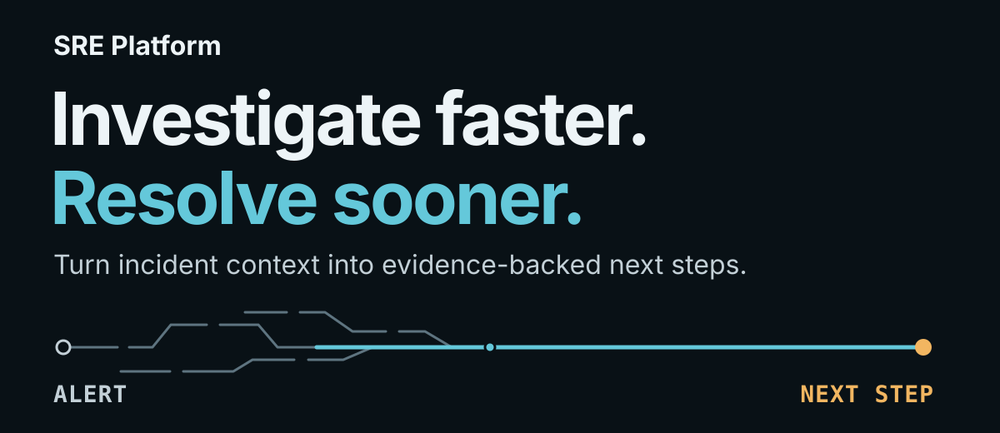
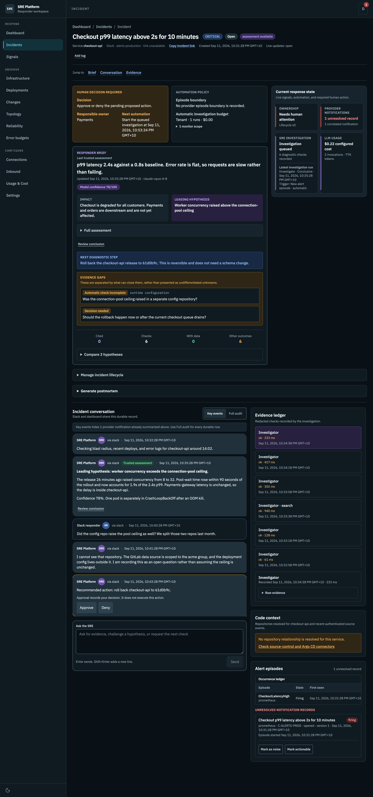
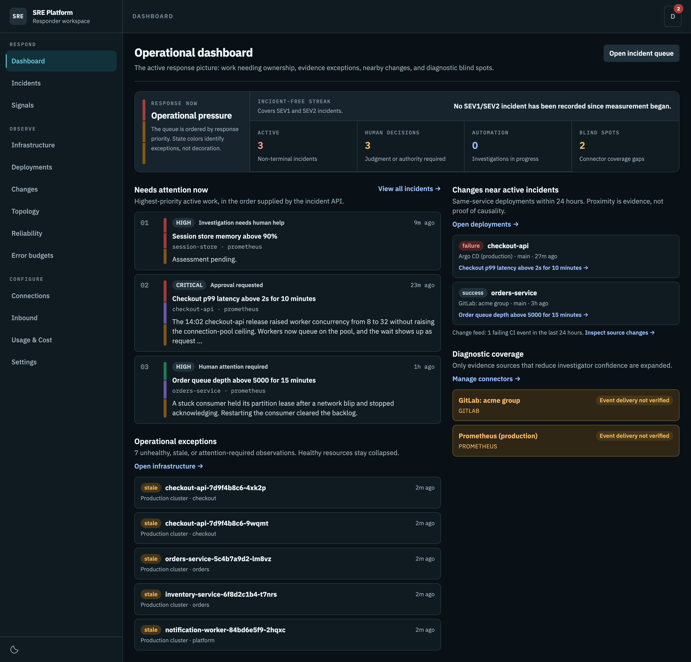
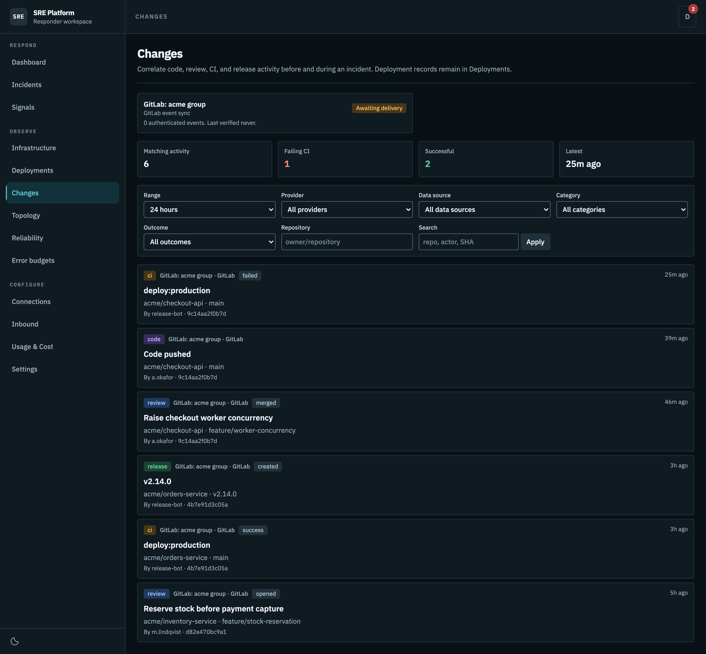

<p align="center">

  

</p>

SRE Platform is an AI incident investigation platform built to reduce investigation time and ***mean time to recovery (MTTR)***.
It gathers context from your connected tools, weighs likely causes, and recommends the next step
in your incident conversation.

[Get started](docs/get-started/local-development.md) · [Connect your tools](docs/connectors/index.md) · [Documentation](docs/index.md)

Full-page captures from the demo workspace. Select an image to view it at full resolution.

[](docs/assets/screenshots/incident-detail-dark.png)

## Spend less time rebuilding context

- **Start with an investigation.** When an alert warrants investigation, the platform opens an
  incident and gathers evidence from your connected tools.
- **Get to the next decision.** Review likely causes, supporting evidence, and a recommended next
step together. Missing evidence and uncertainty stay visible.
- **Continue from what is known.** Ask follow-up questions in Slack or the dashboard. The
investigation builds on stored evidence instead of starting over.

See [how triage works](docs/understand/triage.md) and the
[incident workspace](docs/dashboard/incident-workspace.md) for the investigation flow and its limits.

## See the investigation context

### Know what needs attention

The [operational dashboard](docs/dashboard/overview.md) brings together incidents needing a person,
nearby deployments, and gaps in diagnostic coverage.

[](docs/assets/screenshots/overview-dark.png)

### Find what changed

The [changes feed](docs/dashboard/changes.md) brings code, review, CI, and release activity into one
timeline, with filters to narrow the investigation.

[](docs/assets/screenshots/changes-dark.png)

## Local development

Requires Bun and Docker, plus Node.js for the test suite. See the
[prerequisites](docs/get-started/local-development.md#prerequisites) for required versions.

```bash
cp .env.example .env        # then set SECRETS_MASTER_KEY (openssl rand -base64 32)
bun install
bun run dev:setup           # start local services, wait for health, apply migrations
bun run dev
```

The dashboard is then on `http://localhost:45173` and the API on `http://localhost:43000`. Run the
repository checks with:

```bash
bun run typecheck && bun run test
```

[Local development](docs/get-started/local-development.md) covers the rest: passwordless dev
sign-in, the optional Kubernetes port-forward tunnels, and `bun run db:reset`.

## Explore the project

- [User and operator guide](docs/index.md)
- [Workspace layout](CLAUDE.md)
- [Domain glossary](CONTEXT.md)
- [Contributing](CONTRIBUTING.md)
