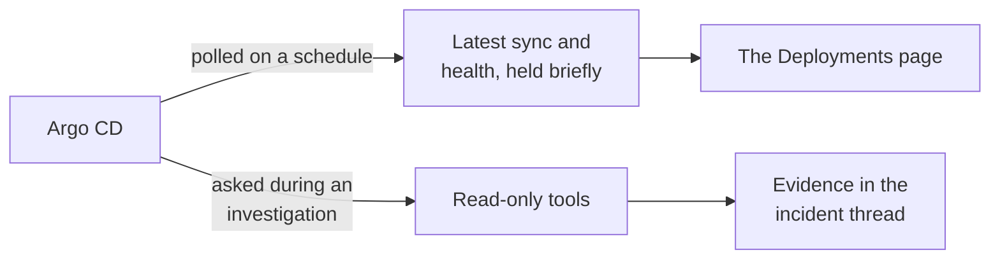

# Argo CD

Argo CD gives the platform two separate views on the **Deployments** page: what your Applications
look like right now, and a durable history of completed syncs.

The connector never syncs, rolls back, refreshes, or writes anything. Every request it makes is a
read.

## What it adds to an investigation

The two are kept apart on purpose. An Application that is currently out of sync, degraded, or
mid-operation is shown as current state, never as a completed deployment.

## How it is wired

The poll answers what the state is now. The tools answer what it was when the incident started, and
which sync changed it.

## Before you start

| You need | Why |
| --- | --- |
| Your Argo CD address | HTTPS is recommended. HTTP is restricted to internal networks and requires risk acknowledgement |
| Existing dedicated project-role tokens, or administrator access to install them | Reuse read-only access, or create it if needed |
| Your certificate authority, or system trust | For a self-signed certificate |

## Connect it

Open **Connections**, choose **Add connection**, then **Add Argo CD**. Five steps. Unlike every other
connector, the middle three repeat per project. The catalog and the shape every wizard shares are
in [Set up a connector](setup.md).

### 1. Server

Your Argo CD address, and whether to trust the system certificate store or a certificate authority
you paste.

The wizard checks the URL before continuing. For an internal service that serves HTTP, enter its
HTTP URL and acknowledge that project tokens and API responses travel unencrypted. TLS controls
are hidden for HTTP. Public HTTP destinations are rejected during verification, before sending a
token. The platform must also be allowed to reach the service by your network policy.

For example, an Argo CD server running without TLS in the `argocd` namespace may use
`http://argocd-server.argocd.svc.cluster.local`. Verify the service name, namespace, port, and server
protocol for your installation. Changing the prefix to HTTPS does not enable TLS on the server.

### 2. Projects

List your projects with the command the wizard shows, then add only the ones this tenant needs and
the applications each may read. Use `*` only when you mean it. Each project gets its own credential
and its own verification result.

### 3. Access and tokens

**Use existing project access** is the default. Enter the existing dedicated role name used in
every selected project, then paste that project's token. Tokens are verified against the exact
project-role identity and required permissions. No installation or uninstall commands are needed.
When editing an unchanged connection, blank token fields keep the stored credentials.

Expand **How to find the existing role and token** under each project for copyable role-list,
role-details, and token-creation commands. Commands use the project and role entered in the wizard.
Run them with an authorized Argo CD CLI session connected to the server from step 1. Argo CD cannot
retrieve a lost token; create a new token for the existing role instead. The command defaults to a
one-year expiry. Adjust it to your policy and replace the token before it expires, because the
platform does not renew pasted tokens automatically.

Each data source still needs its own role name. A role already assigned to another data source is
rejected. The legacy `sre-platform` role is reserved for existing connections; manage that connection
instead of adding another one. A saved connection's role cannot be renamed in the wizard.

Choose **Generate dedicated access** for a new role. Run each generated install command yourself,
then create and paste one token per project. Installation requires Argo CD administrator access.
Never delete an existing role just to reuse or rotate a token; deletion revokes access for its consumers.

You can also select **Generate dedicated access** when editing a saved connection. It generates
instructions for that connection's saved role name, not a new identity. It always shows separate
role-creation and read-policy commands. Run role creation only after confirming the role is missing;
skip that step for an existing role. Adding read policies does not remove old or excessive grants.
Switching between access methods keeps saved credentials and shows only one token-generation guide.

Generated access also shows role-list and role-details commands before token creation. A saved
credential does not prove the role still exists. If lookup reports a missing role, check the CLI's
server first. The role must be defined in the AppProject's `spec.roles`; global RBAC policy lines
alone do not create it. Conditional installation instructions are visible in the main flow. For a
GitOps-managed project, update its source manifest instead of making a change reconciliation may
remove. Preserve the rest of the project, confirm the role exists, then generate a fresh token.

The neutral **Credential saved** badge means only that the platform stores a credential. It does
not mean the role exists, the token is valid, or verification passed. Leave the token field blank
to keep that credential, or paste a replacement. Verification reports access separately.

### 4. Review

Every project and application scope, with no tokens shown.

### 5. Verify

Runs per project. Polling starts only once every project passes every check; until then the
connector stays off.

If verification fails, choose **Edit configuration** to return to Projects without closing the
wizard. Your draft is kept. Use **Back** to change the server, or continue through Access and tokens
and Review to save and verify again. **Close** leaves the disabled connection saved for later.

This step runs against your real system, so it is not pictured here.

### Why it is set up per project

The access the wizard creates is an
[Argo CD project role](https://argo-cd.readthedocs.io/en/stable/user-guide/projects/#project-roles)
governed by Argo CD's own
[permission model](https://argo-cd.readthedocs.io/en/stable/operator-manual/rbac/). It does not
create a global account and does not touch the Argo CD installation's own configuration, so
redeploying Argo CD will not wipe it out and it stays owned by the project rather than by the
platform.

Each role grants exactly two permissions inside its project: read an application, and read its logs.
No project, cluster, repository, write, sync, override, action, or exec access. The wizard gives you
the uninstall command alongside the install one.

Every data source gets its own uniquely named role, so two sources covering the same project keep
their tokens and their policy changes separate.

## What it can read

Every tool is read-only:

--8<-- "_generated/connector-tools/argocd.md"

Argo CD's own permissions are not the only thing standing between a tool and an application it
should not see. The platform checks the returned application against your saved scope as well, and
filters lists locally, so a permissions mistake on the Argo CD side does not become a data leak
here.

The address must be HTTPS or internal HTTP and must not carry credentials, query parameters, or a
fragment. HTTP requires every resolved address to be in RFC1918, CGNAT, or IPv6 unique-local space.
HTTP requests connect to the validated IP and retain the original Host header, preventing a second
DNS lookup from redirecting plaintext credentials to a different destination.
Private network addresses are allowed, but loopback, link-local, cloud
metadata, and unsafe IPv6 addresses are refused. Every request stays pinned to the address that was
validated, times out after eight seconds, and refuses to follow a redirect.

## What verification checks

Saving creates a draft that is switched off. Verification then proves, in order:

1. The token belongs to the dedicated non-administrator account you configured, and that account is
   enabled with API-key access only.
2. Every application read you configured is actually permitted.
3. Mutation and exec are **not** permitted.
4. A sample of access outside your configured scope is refused.
5. A scoped application listing succeeds.

Step 4 catches the common mistake of a broad default policy granting more than intended, which no
deny rule can take back. It is a sample, not a proof: the platform reports required reads and
detected over-grants separately and never claims to have proven least privilege exhaustively. That
is why scope is enforced locally on every read as well.

Authentication, certificate, and permission failures are reported as distinct problems, and any of
them keeps the connector switched off. Provider responses, tokens, manifests, and certificates are
never used as health telemetry.

## Secrets in manifests

One tool returns live and desired Kubernetes manifests, and a live secret contains its data. Argo CD
masks secret values itself, but that masking has a
[known bypass on the diff path](https://github.com/argoproj/argo-cd/security/advisories/GHSA-3v3m-wc6v-x4x3),
so the platform does not rely on it.

Every manifest is redacted by the same code the Kubernetes connector uses: secret and config values
and container environment values are replaced, while their keys are kept so the shape stays
readable. Manifest bookkeeping that carries a second copy of the same values is stripped. A manifest
that will not parse is replaced with a marker rather than passed through.

Any other field that happens to contain a manifest is scrubbed too, so a future Argo CD release
cannot introduce a secret-bearing field that slips past.

So that there is exactly one place doing this, the generic passthrough tool refuses every endpoint
that can return a manifest and points the model at the tool that redacts. Application list and
detail endpoints are refused too, because an application can carry inline chart values and plugin
environment values. Responses are size-capped before they are parsed.

## Polling and history

Each poll makes one bounded, scoped listing.

Current Application state is cached without a revision identifier, so an in-progress operation can
never be recorded as a completed deployment. Completed history is written as deployment records
keyed by an identity Argo CD cannot change, so a renamed application does not duplicate its own
history.

What history keeps: the ordered revisions, the outcome, start and finish time, who triggered it, and
a link back to the Argo CD interface. What it does not keep: the destination cluster, because Argo
CD's history does not record it and inventing one from current state would be a guess. The live view
still shows the current destination.

Two applications deploying the same revision stay distinct records. Seeing the same history entry
again updates the existing record rather than adding another.

## After it is connected

Tokens are encrypted and write-only. The platform will never show one back to you. Editing is
designed so you do not have to re-paste everything:

- Leave a project's token blank and the stored one is kept.
- Paste a new one and only that project rotates.
- Remove a project and its token is deleted.
- Add a project and it needs its own token.

Changing the server address requires fresh tokens for every project, so a stored token can never be
replayed against a different Argo CD.

For certificates, use system trust or paste a certificate authority. Later edits report only that
one is configured, never its contents. Turning certificate verification off is a last resort: the
platform refuses to save it without an explicit acknowledgement of the risk, and it is always
reported as bypassed, never as verified.

**Disconnect** removes the configuration, deletes every encrypted token, and stops polling. Cached
state is dropped immediately, and an edit or a failed verification drops it too, so stale state
cannot be served after a change.

It cannot revoke the tokens on the Argo CD side. If you want the roles and tokens gone there as
well, run each project's uninstall command from the Manage wizard before you disconnect.
