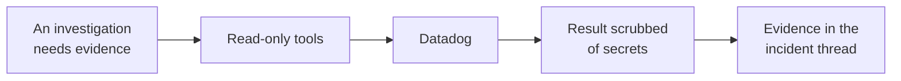

# Datadog

Reads your Datadog organisation: logs, spans, events, error tracking, and metric queries.

Alerts do not arrive through it. They arrive in Slack, like every other signal.

## What it adds to an investigation

This is usually the connector that turns "checkout is slow" into "checkout is slow because this one
downstream call started timing out".

## How it is wired

One path. Nothing is polled and nothing is pushed, so between incidents the platform sends Datadog
no traffic at all. Every request exists because an investigation asked a specific question.

## Before you start

| You need | Why |
| --- | --- |
| Your Datadog site | The platform will only talk to one of the nine official ones |
| An API key | Required for every read |
| An application key with read scope | Datadog requires both for reads |

The nine sites: `datadoghq.com`, `us3.datadoghq.com`, `us5.datadoghq.com`, `datadoghq.eu`,
`ap1.datadoghq.com`, `ap2.datadoghq.com`, `uk1.datadoghq.com`, `ddog-gov.com`, `us2.ddog-gov.com`.

Because that list is fixed in the platform itself, your keys can only ever be sent to a real Datadog
host. There is no free-text address to get wrong.

## Connect it

Open **Connections**, choose **Add connection**, then **Add Datadog**. Four steps. The catalog and
the shape every wizard shares are in [Set up a connector](setup.md).

### 1. Connection

Name the connection and pick your site from the fixed list. Because that list is built into the
platform rather than typed by you, your keys can only ever be sent to a real Datadog host. The site
is stored in the clear, because it is not a secret.

### 2. Credentials

Both keys, because Datadog requires both for reads. They are stored together as one encrypted
credential and sent as request headers, never in an address.

### 3. Review

Provider, endpoint, and access mode. No keys.

### 4. Verify

Checks the API key first, then proves the application key with a monitor read. The connector is
switched on only if both succeed.

This step runs against your real system, so it is not pictured here.

## What it can read

--8<-- "_generated/connector-tools/datadog.md"

Every tool is a read. One of them makes a POST request, because that is how Datadog's search
endpoint works, but the model chooses a search domain from a fixed list rather than supplying a
path, so it cannot reach anything else. Time ranges accept either an exact timestamp or a relative
expression such as `now-15m`.

Requests time out after eight seconds and refuse redirects.

## Secrets in results

This connector has no redaction rules of its own. What it reads is application content, logs, spans
and events, which can only be size-limited, not field-redacted.

Where a Datadog endpoint does return something structured and secret-bearing, such as a key listing,
the platform's general redaction removes it by field name and by recognising credential-shaped
values. The residual case, a token buried inside a free-text field such as a webhook address, is the
same limit that applies to any log line. Your egress rules and per-customer key isolation remain the
real controls.
