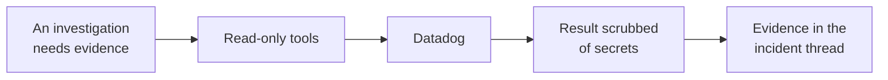

# Datadog

Read logs, spans, events, error tracking and metrics from your Datadog organisation.
This connector gathers evidence; configure alert intake separately under **Inbound**.

## What it adds to an investigation

Use metrics to check symptoms, then inspect logs and available traces for possible causes.

## How it is wired

Investigation tools read data on demand. Separately, automatic topology discovery reads bounded
batches of hosts, monitors and Software Catalog declarations. APM span discovery is optional.
These background reads never create incidents or modify Datadog.

## Topology without APM

Leave **Collect APM service-call evidence** off if your organization does not have indexed APM
spans. New connections start with this option off; existing connections preserve their previous
behavior until you change it. Hosts, monitors and catalog declarations are collected independently,
and metrics and logs remain available during investigations.

Host discovery requires `hosts_read` and monitor discovery requires `monitors_read`. A denied
collection does not erase earlier evidence or stop unrelated collections; a rate limit pauses
further discovery requests for the connection.

An unambiguous `service` tag can declare a host association or monitor scope. Conflicting service
or environment tags remain unresolved. Hosts with no service tags still appear as infrastructure;
co-location and similar names do not establish service calls. Topology does not retain host
metadata, monitor queries, messages or unrelated tags.

## Before you start

| You need | Why |
| --- | --- |
| Your Datadog site | Requests are restricted to supported Datadog endpoints |
| An API key | Required for every read |
| An application key with read permissions | Required for the data you want to query |

Supported sites: `datadoghq.com`, `us3.datadoghq.com`, `us5.datadoghq.com`, `datadoghq.eu`,
`ap1.datadoghq.com`, `ap2.datadoghq.com`, `uk1.datadoghq.com`, `ddog-gov.com`, `us2.ddog-gov.com`.

## Connect it

Open **Connections**, choose **Add connection**, then **Add Datadog**.
See [Set up a connector](setup.md) for the shared setup workflow.

### 1. Connection

Name the connection and select the site where your Datadog organisation is hosted.

### 2. Credentials

Enter the API key and application key. They are stored encrypted and sent in request headers,
not URLs.

### 3. Review

Check the provider, endpoint and access mode. Keys are not displayed.

### 4. Verify

Verification checks the API key and attempts a monitor read with the application key.
It does not verify access to every optional discovery API.

This step runs against your real system, so it is not pictured here.

## What it can read

Enable **Discover traffic from logs** when editing the connection to add bounded request evidence
to topology. This is separate from APM and uses the existing log-read permission. It is off until
you enable it, including for existing connections after an upgrade.

The platform scopes these reads to cluster and namespace pairs reported by this workspace's enabled
Kubernetes inventory connections, capped at 64 pairs per sample. Namespace-restricted connections
do not authorize logs from other namespaces. Connect Kubernetes first if coverage reports a missing scope.
Logs must include the matching cluster identifier, namespace and pod name. A service label alone
does not identify a runtime component.

Supported evidence includes ingress-nginx upstream access logs and completed structured gRPC
client/server records. Loopback calls, malformed records and ambiguous identities do not create
cross-workload dependencies. Database or Redis counters alone do not identify a destination.

Every collection samples up to three request formats, with at most 200 records per format, from
a fixed ten-minute window. More provider results are reported as partial coverage rather than
silently presented as a complete graph. A provider rate limit stops further reads in that attempt.
Subsequent scheduled reads respect a bounded provider cooldown, at least five minutes.

The map preserves request direction, response versus attempt, evidence time and resource type.
Service virtual IPs remain Service endpoints; their backing pods are routing context, not proof
of which pod handled a request. Endpoint matches require inventory observations that bracket the
log's timestamp, so a new connection may need another collection before links resolve.
Host-network Pod addresses are not exclusive identities. Changed or retired endpoint bindings
are retained for up to 24 hours, bounded to 32 prior bindings per resource and the inventory size
limit. A historical call stays attached to its original identity, not an IP's replacement owner.

Repeated samples do not refresh an edge's event time. Retained log relationships expire after
24 hours on subsequent collection and may become stale sooner. Empty samples do not prove that
a dependency disappeared. Raw log messages, request parameters and credentials are not stored
as topology evidence.

### Investigation tools

--8<-- "_generated/connector-tools/datadog.md"

Tools are read-only, including POST search requests. Search domains are fixed; the model cannot
supply an arbitrary API path. Time ranges accept timestamps or relative expressions such as
`now-15m`. Requests time out after eight seconds and refuse redirects.

## Secrets in results

Tool results pass through shared credential redaction and size limits. Redaction cannot guarantee
that every secret in application text is recognized. Restrict key permissions and avoid logging
credentials in the source system.
