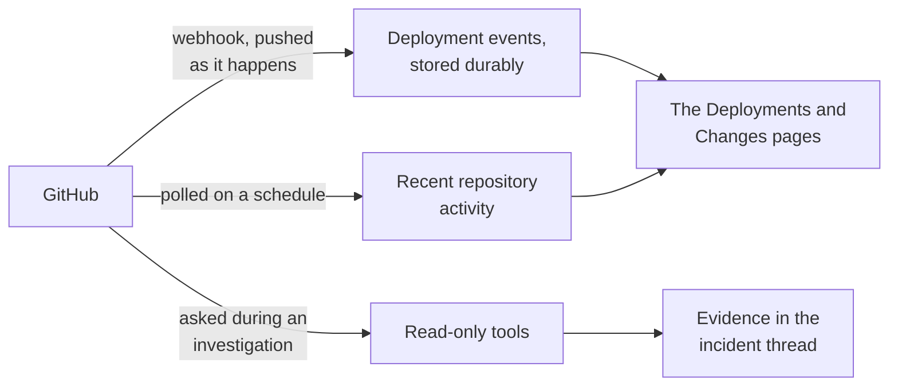
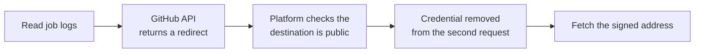

# GitHub

Works through a GitHub App you install. One App may expose hundreds of repositories: the platform
catalogs all of them and reads only the ones relevant to an incident.

It talks to `https://api.github.com` and nowhere else. GitHub Enterprise Server is not supported
yet.

## What it adds to an investigation

## How it is wired

Three paths. The webhook is the one that matters for timing: a deployment that arrives by webhook is
recorded at the moment it happened, which is what makes lining it up against an alert meaningful.
The poll is a backstop, and the tools are called only during an investigation.

## Before you start

| You need | Why |
| --- | --- |
| A **dedicated** GitHub App | Sharing one ties two products' permissions and failure modes together |
| Permission to install it on the account | The catalog is whatever the App can see |
| A public HTTPS address, in a deployed environment | For signed event delivery |

Do not reuse an App that already runs a pull-request or issue bot. Sharing a private key and webhook
secret ties the two products' permissions, trust, and failure modes together.

### Permission and event contract

| Capability | Level | Why |
| --- | --- | --- |
| Contents | Read, required | Commit history, diffs, source search, and file reads |
| Pull requests | Read, optional | Change and review context |
| Actions | Read, optional | Workflow runs, failing jobs, and bounded logs |
| Deployments | Read, optional | GitHub deployment evidence when the organization uses it |

The App subscribes to `push`, `pull_request`, `workflow_run`, `deployment`, `deployment_status`, and
`repository`. Installation and repository-membership events maintain the grant itself.

## Connect it

Open **Connections**, choose **Add connection**, then **Add GitHub App**. Five steps, and you connect
an App installation rather than a repository. The catalog and the shape every wizard shares are in
[Set up a connector](setup.md).

### 1. App

Name the connection, choose the App owner, and choose the event transport. Local development uses a
private relay channel; a deployed environment uses the API's public HTTPS origin.

**Create dedicated GitHub App** is the normal path. GitHub's App Manifest screen shows the exact
permissions and events before creation, and on return the platform exchanges the one-time code and
stores the generated private key and webhook secret, encrypted together and never shown back to
you. Each data source needs its own App, because an App registration has one webhook URL and one
secret.

The screenshot shows the alternative **Existing dedicated App** path, which takes an App ID,
private key, and webhook secret directly. Use it only when that App's webhook and secret are not
shared with another product.

#### Existing App: field-by-field setup

1. Open the App owner's account or organization **Settings → Developer settings → GitHub Apps**,
   then **Edit** the dedicated App. Do not use an App whose webhook is used by another integration.
2. Copy **App ID** or **Client ID** into **GitHub App ID or client ID**. This is not the installation
   ID, an OAuth client secret, or a personal access token.
3. Use an existing private-key PEM for this App, or choose **Generate a private key** under
   **Private keys** if you no longer have it. Paste the entire PEM file
   into **Private key (PEM)**, including the begin and end lines. Keep the file secret.
4. Reuse the existing webhook secret, or choose a random one of at least 16 characters. Enter the same value in this wizard
   and the App's **Webhook secret** field. Neither product can recover a forgotten secret for you;
   replace it on both sides if necessary.
5. Under **Permissions & events**, grant the read permissions listed above. Install the App on the
   account and repositories you want to investigate. Accept installation permission changes if you
   edited an existing App. SRE Platform rejects write permissions.
6. Choose **Public HTTPS API** for a deployed platform. The webhook address is generated from the
   platform's deployment configuration. There is no API URL to enter. If public delivery is
   unavailable, ask the platform administrator to correct the deployment's public HTTPS API URL.
7. Copy the **GitHub webhook URL** shown in the delivery section into the App's **Webhook URL**
   field. It is available before saving and stays the same when you save. Do not invent its path or
   enter only the API origin. Keep SSL verification enabled. Then choose **Check existing App**,
   select the installation, review coverage, and save in SRE Platform.
8. Subscribe to Push, Pull request, Workflow run, Deployment, Deployment status, and Repository
   events. From **Advanced → Recent Deliveries**, redeliver a ping. Confirm the first signed event
   appears on the connector card, separately from code-access verification.

An existing saved connection shows its webhook URL immediately when you open **Manage**, without
another save. A new connection allocates its unique path during setup. If the API URL is
missing or invalid, the wizard asks for an administrator to correct deployment configuration
instead of offering a placeholder or a per-connector override.

For local development, choose **Smee relay**. The wizard creates and displays a channel automatically;
copy it into GitHub's **Webhook URL** field. You can also enter a channel you already use. The relay
starts when the connection is saved, not when the URL is prepared. Redeliver any test event sent
before saving. Back/Next keeps the prepared address; closing an unsaved setup discards it.
Anyone with the Smee URL can observe relayed traffic, so treat it as a development secret.

The webhook URL is not an **OAuth Callback URL**. An existing App uses installation credentials
for this connector, not an interactive GitHub user sign-in flow. The new dedicated App path
configures its manifest return flow automatically.

See GitHub's [App registration guide](https://docs.github.com/en/apps/creating-github-apps/registering-a-github-app/registering-a-github-app)
and [private-key guide](https://docs.github.com/en/apps/creating-github-apps/authenticating-with-a-github-app/managing-private-keys-for-github-apps).

For local development the relay channel is stored with the credential. Saving starts its relay
immediately, editing the channel replaces it, disconnecting stops it, and startup restores saved
relays. No separate command or restart is needed.

### 2. Installation

Install the App for all repositories responders may need, or a managed subset, then choose the
installed account here. The panel shows which permissions that installation actually granted, and
warns if any of them is write rather than read.

### 3. Coverage

What the installation can actually see, so you find out here rather than mid-incident. There is no
repository-by-repository selection inside the platform: the catalog follows the installation's
current GitHub grant.

### 4. Review

The App, the installation, its coverage, and the event transport.

### 5. Verify

Mints a read-only token, lists what the App can see, and requires read access to repository
contents. If those checks fail the connection stays switched off. A missing optional permission is a
visible warning, not a failure.

This step runs against your real installation, so it is not pictured here.

## Repair an existing connection

Open the saved connection's setup. The **Repair this connection** section offers two independent
write-only replacements. Blank fields keep the stored values; no secret is read back into the form.

- **Repair webhook delivery:** check the destination URL, then set a matching webhook secret in
  the GitHub App and SRE Platform. Use at least 16 characters. A signature failure alone does not
  require replacing the App private key. A saved Smee channel is not displayed; enter a different
  channel only when intentionally changing the destination on both sides.
- **Replace private key for API access:** generate a key in the same GitHub App and paste its PEM.
  This is for API authentication failures, for example a revoked key. It does not change App identity.

Check the current installation, review coverage and the pending replacements, then **Save, sync,
and verify**. Failed verification offers **Edit configuration**, retaining entered values for
correction and retry. Replacing a webhook secret interrupts delivery until both ends match.

After saving, open the GitHub App's **Advanced → Recent deliveries** and redeliver an event.
Installation access, configured secrets, and a connected Smee relay do not prove signed delivery;
check event-delivery evidence on the connection card. See GitHub's
[redelivery guide](https://docs.github.com/en/webhooks/testing-and-troubleshooting-webhooks/redelivering-webhooks)
and [signature troubleshooting](https://docs.github.com/en/webhooks/using-webhooks/validating-webhook-deliveries#troubleshooting).

## What it can read

Every tool call is a read. The one non-read request the connector makes is minting the short-lived
installation token described below, which is not reachable from a tool.

--8<-- "_generated/connector-tools/github.md"

Repository contents are not copied into the platform's database. The durable catalog holds
repository identity and branch metadata, and the event store holds bounded change summaries. When an
investigation needs code, the platform mints a short-lived installation token narrowed to the
resolved repository and the App's current read permissions. Tokens are cached by repository scope
for that investigation and are never stored.

### Reading a job's logs

This is the one call that leaves GitHub's API host. GitHub redirects to a short-lived signed address
on a content-delivery host, which moves around.

The platform does not follow that redirect automatically, and it removes the credential before
making the second request, so the installation token can never end up somewhere unexpected. The
signed address needs no credential of its own.

## Which repository belongs to which service

Argo CD Application sources automatically create a service to repository relationship. If no
relationship exists, an exact case-insensitive match against the repository name or full name is
used.

Ambiguous services stay explicit: the investigation can search the catalog, but it does not scan
every repository or guess by fuzzy similarity. That keeps a 300-repository installation useful
without turning every incident into 300 API reads. The incident workspace labels where the
relationship came from and lets a responder confirm the resolved repository for that service.

## Secrets in results

This connector has no redaction rules of its own, and does not need any. GitHub never returns the
value of an Actions secret, and Actions variables are not secret by definition, so there is no
endpoint returning structured secrets to redact. Job logs are free text and go through the same
general redaction every tool result does.

## Event delivery health

Every delivery is authenticated with `X-Hub-Signature-256`, bound to the configured installation,
deduplicated by `X-GitHub-Delivery`, and reduced to an allowlisted event summary. Raw webhook bodies
are not stored. The connector card reports the last attempted and verified delivery, the event
count, and a sanitized failure category.

## After it is connected

**Retest** refreshes point-in-time access and the repository catalog. Repository membership changes
then arrive by signed webhook.

**Disconnect** removes the encrypted key, the webhook secret, and the configuration. It does not
uninstall the GitHub App, which must be removed in GitHub when access should be revoked.
