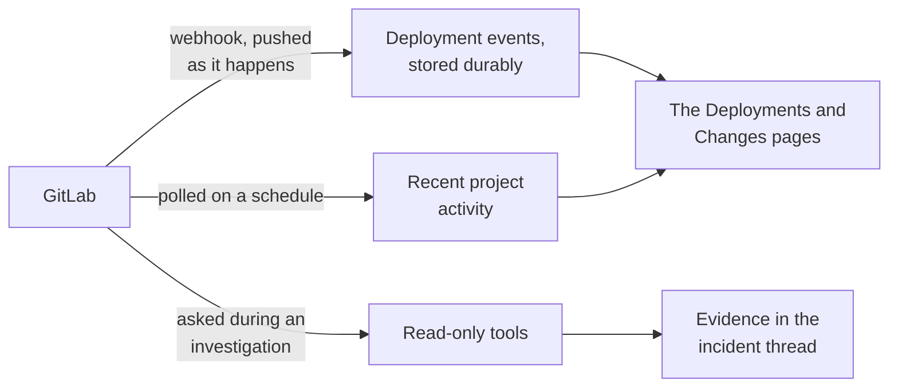

# GitLab

## Optional issue management

Issue reads use the existing read-access token. To allow confirmed changes:

1. Create a dedicated GitLab project or group access token with **api** scope and a role permitted
   to edit the target issues. Limit its repository access and expiry.
2. In the connection wizard, enable **Allow confirmed issue changes**.
3. Enter allowed full project paths, one per line, and paste the token into **Issue-write access token**.
4. Save and verify the connection. Do not replace the read-only discovery token.

The write token is encrypted and never shown again. Leave its field blank to keep it. Disabling
issue management removes the stored token; changing the GitLab target requires a new token.
GitLab assignees use numeric user IDs. See
[repository issues](../dashboard/incident-workspace.md#repository-issues) for the confirmation flow.

Descriptions cannot contain slash-leading lines, including GitLab quick actions. These can trigger
extra provider changes, so remove or escape them and review a new preview.

Reads one top-level group, on gitlab.com or your own instance. It syncs every project in that group
and its subgroups, then narrows to the few projects relevant to an incident.

Connect it at the group level. An older project-level shape still works and offers fewer tools,
which is why the tool table below is listed once per shape.

## What it adds to an investigation

Deploy correlation is the second question every investigation asks, right after blast radius. This
connector is what answers it.

Investigation tools resolve an exact project ID or full path before partial catalog matches. An
empty search or standalone `*` lists a bounded sample, up to 50 projects per tool call. Results and
subsequent reads stay within the connection's synchronized catalog; removed projects are excluded.
An empty result means no catalog match, not that GitLab lacks pipeline or job history.

## How it is wired

Three paths. The webhook is the one that matters for timing: a deployment that arrives by webhook is
recorded at the moment it happened, which is what makes lining it up against an alert meaningful.
The poll is a backstop, and the tools are called only during an investigation.

## Before you start

| You need | Why |
| --- | --- |
| Your GitLab address, over HTTPS | A self-managed private address is allowed |
| The full path of one top-level group | Everything under it becomes the catalog |
| A group access token, Reporter role, `read_api` scope | Reporter can read code but cannot push |
| Owner access to add webhooks, for event delivery | Optional. You can connect reads only |

Reuse a valid [group access token](https://docs.gitlab.com/user/group/settings/group_access_tokens/), or create one if needed, with
the Reporter role, [`read_api`](https://docs.gitlab.com/security/tokens/access_token_scopes/), and an
expiry date. GitLab.com requires Premium or Ultimate for group access tokens; the fallback is a
dedicated [group service account](https://docs.gitlab.com/user/profile/service_accounts/) added only
to the target group as Reporter, with a `read_api` token. A personal operator token is not
recommended.

## Connect it

Open **Connections**, choose **Add connection**, then **Add GitLab**. Five steps, and you connect one
group rather than a list of projects. The catalog and the shape every wizard shares are in
[Set up a connector](setup.md).

### 1. Scope and access

The GitLab address, the top-level group full path, and a read-only access token. The platform
catalogs every project in that group and its subgroups, so there is no project picker anywhere in
this wizard.

### 2. Projects

Pressing **Check access and discover projects** resolves the group and lists every project it owns,
including subgroups but not shared ones, then shows a sample of what it found. Everything returned
becomes the catalog. If discovery fails, nothing is saved, not even the token.

Failures distinguish rejected credentials, denied access, inaccessible groups, rate limits,
connectivity, timeouts, and response limits. A diagnostic reference links the error to safe API
logs without logging the token or provider response body. Enter a group path, not a personal
namespace. A not-found response can also mean the token cannot see that group.

Discovery shares a budget of two transient retries across its requests. Each request attempt has
an eight-second timeout. It does not retry authentication or permission failures. Rate-limit
retries require a usable `Retry-After` of at most two seconds; longer waits are left to the operator.
Entered form values remain available for a manual retry while the modal stays open.

### 3. Events

Choose the event source separately from the transport:

| Event source | Who installs it | Coverage |
| --- | --- | --- |
| Project hooks | Manual installation, or a workspace administrator authorizes automatic management with a separate GitLab credential | Webhook events from installed projects. Automatic management includes future projects; existing manual connections stay manual. |
| Group hook | Group Owner, with Premium or Ultimate | One hook covers this group, subgroups, and future projects. |
| System hook + polling | Instance administrator on Self-Managed or Dedicated | Repository events through one instance hook; CI/CD and release observations through read-only polling. |

[Group webhook availability](https://docs.gitlab.com/user/project/integrations/webhooks/#group-webhooks)
depends on the subscription, not just Enterprise edition metadata. Choose **Public HTTPS API** for
a deployed receiver, or **Smee relay** for local development. The connector manages its relay.
**Configure later** leaves webhooks unconfigured. With **System hook + polling** selected, scheduled
read-only polling still starts after access verification; otherwise reads happen during investigation.

**Smee signature limitation:** the relay re-serializes the parsed JSON body. Formatting, escaped
characters or numeric representations can change, invalidating an otherwise correct GitLab signature.
The receiver rejects these deliveries; it does not bypass signing or fall back to a legacy secret
when a signature is present. Use a public HTTPS receiver that preserves the original request body
for reliable signed delivery. Rotating a matching signing token cannot fix a modified body. A 200
response from Smee proves relay acceptance, not authenticated delivery to SRE Platform.
See [Smee's signature issue](https://github.com/probot/smee-client/issues/325) and
[GitLab's raw-body signature requirements](https://docs.gitlab.com/user/project/integrations/webhooks/#signing-tokens).

**Set up webhooks in GitLab** shows the installation checklist here, before saving:

1. Review the address and signing token, then **Save and verify** to activate the receiver.
2. Use `glab` and `jq` with webhook-management access to run the installation command. The read-only
   discovery token is not intended to manage hooks. A preview is available before saving; do not
   run it until the receiver is saved.
3. Open **Project → Settings → Webhooks** in GitLab and test a Push event. The project search in the
   modal links directly to those settings. The bulk command configures those same settings, so do
   not also add duplicate hooks manually.

Manual project hooks cover the catalog at installation time, not future projects. Reopen the connection,
check access to refresh its catalog, save, and rerun the command when projects are added. Saved
connections retain the selected event source independently from transport. For older connections without a saved
scope, confirm it matches the existing GitLab configuration before installing anything.

#### Automatic project hooks and recovery

Under **Project hooks**, select **Automatically manage project hooks**. Save and verify read access,
then choose **Review management scope**. Review the instance, group, receiver, events and planned
project actions before entering a separate management token and authorizing ongoing reconciliation.
Managed push events cover all branches. Reconciliation restores that setting if an owned hook's
branch filter is narrowed; it does not change unrelated hooks.
Use a group-scoped token with the **api** scope and **Maintainer** role, or a dedicated account limited
to the approved projects if group tokens are unavailable. This grants broader API privileges, not
a hooks-only permission. Keep the separate investigation credential read-only.
The preview uses the saved catalog and ownership records, not a live GitLab diff. The worker checks
actual membership and ownership before every write. It never adopts unrelated hooks by matching URL.

Coverage distinguishes covered, confirmed missing, pending and failed hooks. Counts can overlap;
uncertain creation is not reported as confirmed absence. **Stop management** waits for an in-flight
write to finish, removes the stored management credential and prevents subsequent writes. It does
not delete external hooks. An unchanged successful read-access Retest preserves existing approval.

If creation has an uncertain outcome, the worker searches for its ownership marker and does not
automatically send a second creation request. In **Review management scope → Planned project
actions**, uncertain hooks are listed first. Check the project's GitLab webhook list for the displayed
ownership ID in the description. Only if no matching hook exists and the earlier request is no longer
running, select the absence-confirmation checkbox and authorize management again. This permits one
new attempt, preserves the decision in approval history, and still checks for an owned hook before
creating. A stale recovery request is rejected. Ordinary reauthorization does not clear uncertain
creation state unless that project was explicitly selected.

#### System hook setup

The modal includes a field-by-field guide and a link to your configured instance's **Admin → System
hooks** page. Copy the exact URL and generated name. Enable Push, Tag push, Merge request, and
Repository update events, keep all branches and SSL verification enabled, and leave custom headers
and custom templates empty. Project/group/user lifecycle events are automatic, not separate
project-only checkboxes.

The GitLab form's **Secret token** field is not the HMAC signing-token field. Do not paste a
`whsec_…` value there to configure signatures. The generated command installs the signing token via
GitLab's API and creates or updates the named hook. You do not need to create a second hook manually.
If you fill the form first, use the exact generated name and then run the command to attach signing
authentication before testing. Keep an existing legacy secret unchanged unless intentionally rotating
it on both sides. See the [system-hook authentication fields](https://docs.gitlab.com/api/system_hooks/#add-new-system-hook).

The modal also explains connection/TLS failures, authentication failures, wrong receiver paths,
ignored mock tests, and the separate polling checks needed for CI/CD evidence.

System hooks send instance-wide events before this receiver filters them. Ask the GitLab
administrator to approve that destination, even though SRE Platform discards unrelated project,
user, and membership events without storing them. It does not store an instance-administrator token.
Before storing an in-scope observation, the receiver uses the read-only credential to confirm that
the saved numeric group ID still owns the configured path. A renamed or replaced group is rejected
with HTTP 403. If that check is unavailable, the receiver returns HTTP 503 instead of accepting
unverified evidence. Restore group read access or correct the connection scope before retrying.

1. Select **System hook + polling**, choose the transport, and review the receiver address.
2. Save and verify read access. Give the generated installation command and one-time signing token
   to the GitLab administrator. The command runs through their local `glab` login.
3. In GitLab, find the hook under **Admin → System hooks**. Keep SSL verification enabled. The command
   enables push, tag push, merge request, and repository-update triggers. Project lifecycle events
   are delivered by system hooks automatically.
4. Check a real event from the configured group in **Recent events**, then check authenticated
   delivery on the SRE Platform connection. The generic system-hook API test lacks an in-scope
   project path and may be intentionally ignored; its success is not coverage proof.

See [GitLab system hooks](https://docs.gitlab.com/administration/system_hooks/) and the
[system-hook API](https://docs.gitlab.com/api/system_hooks/). System hooks do not supply pipeline,
job, deployment, or release status events. Polling fills those observation gaps, not a full event history.

Pipeline and deployment polling resumes from provider update timestamps, replaying the final
millisecond so equal-time records are not skipped when earlier records change. It does not resume
mutable result sets by offset. Dense timestamp boundaries expand the next read from 20 to at most
100 records. If that cannot make safe progress, the stream retains its cursor and reports
`timestamp_boundary_limit`; other streams continue. This is incomplete coverage, not a credential
failure. For persistent high-density updates, use group or project hooks for ongoing CI/CD delivery.

### 4. Review

The group, what was discovered, and the event transport. No token.

### 5. Verify

The access token, relay channel, and webhook verifier are stored as one encrypted, write-only
credential. Verification proves identity, group enumeration, and code, pipeline, and deployment
reads against a representative project before enabling the connector. The complete project catalog
is reconciled in the same lifecycle.

This step runs against your real group, so it is not pictured here.

New signed event setup is disabled unless discovery confirms GitLab 19.1 or newer. Existing
connections using the older shared-secret header remain usable and readable, so they can be upgraded
deliberately. Replacing a signing token interrupts existing hooks until they use the new token.

The setup guide emits one copy-pasteable command that idempotently creates or updates the selected
group, project, or system hooks with the corresponding supported events. The signing token is copied separately and
entered at a no-echo shell prompt, so it is never embedded in the copied command or retained in
shell history.

Keep the signing token in your secret manager. It cannot be retrieved from SRE Platform after the
modal closes. Installation commands for a saved signed connection prompt for the original token;
if it is lost, replace it explicitly, save, and update every covered hook. Saved Smee channels are
also write-only; enter the original channel when regenerating installation instructions.

The Verify step separates read access from receiver readiness. A connected relay does not prove
GitLab delivery. Check the connection card for authenticated delivery evidence after sending a test
event. One received event proves that hook's path, not that every project has a hook installed.

## What it can read

--8<-- "_generated/connector-tools/gitlab.md"

Every tool is read-only, and every project it is asked about must already be in the synced catalog.
The stored token therefore cannot be turned into a general-purpose reader for the whole instance.

Requests time out after eight seconds, refuse redirects, and are capped in size and page count. Job
traces keep only the last 64 KiB or so. Syncing the catalog stops at 5,000 projects and says so
rather than truncating silently.

## Secrets in results

GitLab responses do not label themselves the way Kubernetes objects do, so the platform decides what
is secret from what was asked for. Continuous-integration and schedule variable values, access,
deploy and trigger tokens, webhook tokens and addresses, runner tokens, and integration settings are
all replaced wherever they appear. Keys and structure are kept; only values go.

Redaction never blocks an investigation. A response the platform cannot parse is passed through with
its shape preserved rather than failing the call outright.

## Event delivery health

The connector card separates point-in-time access verification from ongoing event health. It shows
the group, the project count, verification timestamps, first and last authenticated delivery, event
count, and a sanitized failure category. `Not configured` and `Awaiting first event` are
different states, deliberately.

Failures are reported as one of a few plain categories: the credential is wrong, permission is
missing, you are being rate-limited, the instance is unreachable, or the provider is having a
problem. Two cases are reported as a permissions problem even when GitLab says "not found": listing
the group, and reading a project on a project-level connection. An object the token cannot see is
indistinguishable from one that does not exist, and calling that a permissions problem sends you to
the right place. No response body is ever stored.

Group and project hooks deliver deployment evidence directly. System-hook connections instead
poll it within a fixed per-run budget. GitLab's delivery identifier is the retry idempotency key, and retries do
not increment the event count twice. Only an allowlisted summary is persisted, never the raw body.
GitLab 19.1 and newer payloads are checked in constant time across the delivery identifier, the
timestamp, and the exact raw body; stale timestamps are rejected. The optional instance origin and
project path are bound to the saved group.

### Polling coverage

Before each polling batch, the saved group ID must still match its current GitLab path. If the
group was renamed, deleted, or cannot be checked, polling stops before reading cached projects and
keeps its cursors. Edit and reverify the connection if the group scope changed; transient failures
retry automatically.

System-hook connections show **Project polling coverage** separately from webhook health: total
projects, projects without a successful read, current failures, and projects with pages still pending.
These counts overlap. Expand project details to see up to eight projects, with failures and oldest
reads first, and check each project's last successful read rather than the latest connector batch.

Each run reads one catalog page and at most four projects. Cursors survive restarts; failed reads
do not advance that stream. Active work is prioritized while quiet projects retain polling capacity.
Pipeline and deployment backfill starts with the last 24 hours. Jobs and releases refresh their
latest page between backlog pages. Rate limiting pauses new requests temporarily. Large catalogs
and histories take multiple runs; intermediate status transitions may be missed.

Each stream retains at most 100 active IDs per project. If it reaches that limit, coverage shows an
**Active-work tracking limit reached** warning. Polling continues, but some active work may no longer
be tracked individually. The warning remains after successful reads because those reads do not prove
that previously untracked work was recovered. It resets with the cursors on strategy or scope changes,
not as evidence that the historical coverage gap was filled.

Polling evidence is labeled as polling and does not increment authenticated webhook delivery counts.
The change feed and investigation history collapse matching observations of the same provider
revision, including overlapping webhook and polling observations. Delivery receipts remain separate
for audit. When a revision cannot be identified safely, observations remain separate; the platform
does not infer equivalence from a shared event identifier alone.

When changing strategy, install and verify the replacement before removing the old hook. SRE Platform
does not remove it for you. Strategy or scope changes reset polling cursors while retaining evidence.

## After it is connected

**Retest** reruns the required reads and reconciles the catalog. **Disconnect** deletes the
credential, deactivates the project catalog, and removes the configuration in one transaction.

Group tokens and webhooks on the GitLab side remain until an owner revokes or removes them there.

## Self-managed instances

A self-managed GitLab usually sits on a private network, so the platform allows a private address
here. Loopback, link-local, and cloud metadata addresses stay blocked. See
[Network policy](../operate/network-policy.md).

A private certificate authority is not supported yet. Use a certificate the platform's runtime
already trusts.
