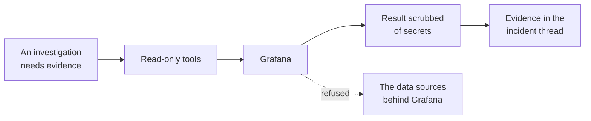

# Grafana

Grafana gives the platform its **own** aggregated state: alerting, dashboards, and annotations
across every backend it sits in front of.

It deliberately stops there. Raw metrics and logs come from the Prometheus and Datadog connectors,
and this connector never reaches through Grafana to a data source behind it.

## What it adds to an investigation

The dotted line is the point of the connector. See [Why it stops at Grafana](#why-it-stops-at-grafana).

## How it is wired

One path, and it stops at Grafana. Nothing is polled and nothing is pushed, so between incidents the
platform sends Grafana no traffic. The dotted edge is deliberate and explained in
[Why it stops at Grafana](#why-it-stops-at-grafana).

## Before you start

| You need | Why |
| --- | --- |
| Your Grafana address, self-hosted or Grafana Cloud | A private network address is allowed |
| A service account token with the Viewer role | That is Grafana's first-class API authentication |
| Your certificate authority, for a self-signed certificate | Otherwise you must explicitly skip verification |

Legacy API keys are deprecated, and basic authentication is a login-form mechanism rather than an
API one. Viewer is enough.

## Connect it

Open **Connections**, choose **Add connection**, then **Add Grafana**. Four steps. The catalog and
the shape every wizard shares are in [Set up a connector](setup.md).

### 1. Connection

The address and its certificate trust. Plain HTTP has no encryption and makes you acknowledge that
here. Use it only on a trusted private network. Loopback, link-local, and cloud metadata addresses
are refused outright.

### 2. Credentials

A service account token. It is stored encrypted and sent as a bearer token.

### 3. Review

Provider, endpoint, and access mode.

### 4. Verify

Makes one authenticated read that any service account can perform. A success switches the connector
on. A rejected token is reported as exactly that, rather than as an unreachable server.

This step runs against your real system, so it is not pictured here.

## What it can read

--8<-- "_generated/connector-tools/grafana.md"

Every tool is a read, confined to Grafana's own API. Anything the model supplies as part of a path
is character-validated first, and an encoded character in a path is refused outright.

The platform uses Grafana's long-standing dashboard API rather than the newer one, deliberately: it
needs no namespace resolution and works identically across every Grafana version and edition.

### What it looks at first

Before any model call, the platform pulls the alerts Grafana is currently firing and matches them to
the incident's service by label where it can. When nothing matches it shows all firing alerts
anyway, because Grafana has no universal notion of a service and "what is firing right now" is worth
knowing regardless.

## Why it stops at Grafana

Grafana is an aggregator, and its data source proxy will happily forward a request to whatever sits
behind it and hand back the raw response. That response can contain a credential Grafana itself
would have redacted.

So the connector refuses every proxy and data source resource path. That is one clean rule, instead
of trying to write a scrubber for arbitrary responses from systems the platform knows nothing about.

## Secrets in results

This connector has no redaction rules of its own. Grafana already omits data source secrets from its
responses, returning only which secret fields are set, and refusing the proxy paths removes the only
way an unredacted secret from a downstream system could arrive.

The one residual, an internal data source address, is topology rather than a credential.
