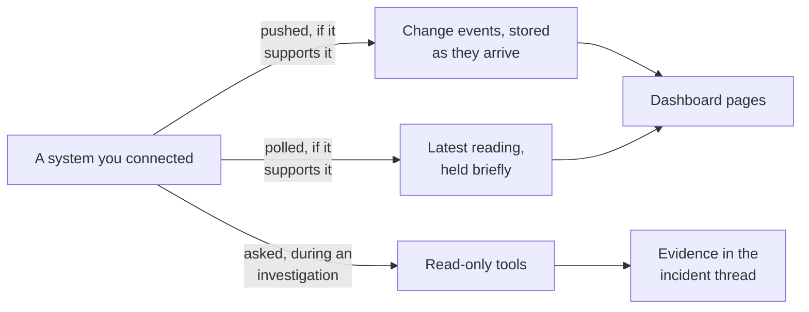
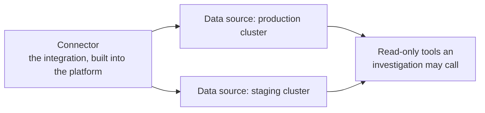

# Connect your tools

A connector gives the platform **read-only** access to one of your systems, so an investigation can
look at real evidence instead of guessing.

You do not need all of them. Connect what your responders actually reach for.

## How a connected system reaches an investigation

Three paths exist, and each connector uses only the ones its system supports. This is the single
most useful thing to know about a connector, because it tells you what it costs you and what it can
answer.

- **Pushed** means your system tells the platform the moment something happens. Only this path
  records the true time of a deployment, which is what makes lining one up against an alert
  meaningful.
- **Polled** means the platform asks on a schedule, whether or not anything is wrong. This is what
  keeps a dashboard page current.
- **Asked** means the platform only ever reaches your system while an investigation is running. A
  connector with just this path sends no traffic at all between incidents.

| Connector | Pushed | Polled | Asked during triage | Page |
| --- | --- | --- | --- | --- |
| Kubernetes | No | Yes | Yes | [Kubernetes](kubernetes.md) |
| Argo CD | No | Yes | Yes | [Argo CD](argocd.md) |
| GitLab | Yes, by webhook | Yes | Yes | [GitLab](gitlab.md) |
| GitHub | Yes, by webhook | Yes | Yes | [GitHub](github.md) |
| Prometheus and Alertmanager | Yes, by Alertmanager delivery | No | Yes | [Prometheus](prometheus.md) |
| Grafana | No | No | Yes | [Grafana](grafana.md) |
| Datadog | No | No | Yes | [Datadog](datadog.md) |
| StatusCake | No | No | Yes | [StatusCake](statuscake.md) |
| Network probe | No | No | Yes | [Network probe](networkprobe.md) |

## What each one contributes

| Connector | Contributes |
| --- | --- |
| Kubernetes | Pods, nodes, events, logs, workload state |
| Prometheus and Alertmanager | Metrics, and the exact alert firing and recovery events |
| Grafana | Unified alerts, dashboards, annotations |
| Datadog | Logs, traces, metrics, monitors, error tracking |
| StatusCake | Uptime tests, history, maintenance windows |
| GitLab | Projects, commits, merge requests, pipelines, deployments |
| GitHub | Repositories, commits, diffs, pull requests, workflows |
| Argo CD | Application sync, health, revision, deployment history |
| Network probe | DNS, reachability, and certificate checks. Built in |

## Where to start

An investigation asks its questions in a fixed order: what is affected, what changed, then what the
evidence says. Connect in roughly that order and each addition makes the next investigation better.

1. **Prometheus**, so alerts arrive with their real firing and recovery events.
2. **Kubernetes**, so it can see what the runtime is actually doing.
3. **GitLab** or **GitHub**, so it can see what shipped just before the problem started.

## Adding one takes minutes

Every connector is added the same way, from the **Connections** page, through a guided wizard that
tells you exactly what to create in the other system and verifies your access before it switches
anything on.

See [Set up a connector](setup.md) for the walkthrough, with screenshots.

If the tool you need is not in the catalog at all, that is a code change: see
[Add a connector](../build/connectors.md).

## Connector against data source

A **connector** is the integration. A **data source** is one configured instance of it, with its own
credential and its own scope. Two clusters means one connector and two data sources.

## What every connector has in common

**Read-only, without exception.** The platform holds no credential that can change anything you
connect. It cannot restart a pod, revert a deploy, or silence an alert.

**Least privilege.** Each page asks for the narrowest access that still answers the questions an
investigation needs.

**Verified when you save.** Setup proves the exact reads the platform needs, and tells you which
permission is missing rather than failing later inside an incident.

**Secrets are stripped from results.** Anything a connector returns is scrubbed before it reaches
the model, the conversation, or the database.

## Two things you cannot connect here

**Network probe** is built in. It needs no credential and no setup, and it only reaches public
addresses. See [Network probe](networkprobe.md).

**AWS and Confluence** appear in the platform's internal catalog but expose nothing to an
investigation yet. There is nothing to set up and nothing to see.

## Where connectors can reach

A connector may only reach the address you configured. Requests to private and loopback address
ranges are refused, including via a redirect or a hostname that resolves to one. See
[Network policy](../operate/network-policy.md).
