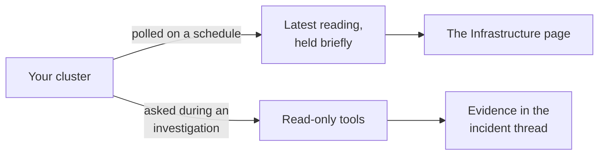
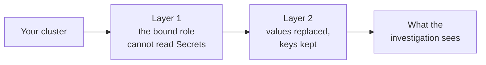

# Kubernetes

Reads live cluster state through your API server, using a service-account token you generate.
It only reads. Alerts do not arrive through it, they arrive in Slack like every other signal.

## What it adds to an investigation

Without it an investigation can tell you a service is erroring but not that three of its pods are in
a crash loop on one starved node.

## How it is wired



Two paths, one credential. The scheduled poll keeps the Infrastructure page current whether or not
anything is wrong. The tools are called only while an investigation is running, and ask narrower
questions than the poll does.

## Before you start

| You need | Why |
| --- | --- |
| An API server address the platform can reach | A private cluster needs an exposed endpoint, a VPN, or a tunnel |
| An existing read-only service account token, or permission to install one | Reuse installed RBAC, or create dedicated access if needed |
| Your cluster CA certificate, if the address is private | A private address cannot be verified against public certificate authorities |

If the platform runs inside the cluster you want to monitor, read
[The cluster the platform runs in](#the-cluster-the-platform-runs-in) first. That case needs one
extra egress rule and it is the most common reason a first connection fails.

## Connect it

Open **Connections**, choose **Add connection**, then **Add Kubernetes**. Five steps, named across the
top of the wizard before you start. The catalog and the shape every wizard shares are in
[Set up a connector](setup.md).

### 1. Cluster


Name the data source, give the API server address, and choose how its certificate is trusted. The
address must be HTTPS. Leave the namespace blank to monitor every namespace, or name one to limit
both the connection test and the ongoing poll to it.

### 2. Access

Choose **Use existing access** if your read-only service account and RBAC are already installed.
This is the default. No installation command is needed, and the platform does not modify your RBAC.
When managing an existing connection, leave its credential blank in the next step to keep it.

The API address alone does not grant access to discover service accounts. Supply a valid token
before verification; choosing a service account name cannot authenticate as that account.

Choose **Create dedicated access** only if you need a separate account. The wizard generates a
least-privilege manifest and one command that applies it, so there is no
separate piping step. It creates a dedicated service account with read-only access to workloads,
nodes, metrics, events, and logs, and no access to Secrets. You need cluster admin once, here.

Generated resources carry this connection's short access ID. Reapplying the same command updates
those exact resources; starting a separate connection generates different names. Never uninstall
resources still used by another connection or application.

### 3. Credentials

For existing access, paste the service account token and cluster CA if required. Use a read-only
account, not an administrator token or personal kubeconfig. When editing, blank fields retain the
stored token and CA. Changing the API server requires a token for the new endpoint.

Open **How to get your existing token and CA (PEM)** in this step for copyable commands:

1. Confirm your kubectl context and list service accounts.
2. Enter the service account's namespace. This is not necessarily the monitored namespace.
3. List token Secrets and find the row matching your read-only service account, then enter its Secret name.
4. Run the token command and paste its decoded output into **Service account token**.
5. If pinning a CA, run the CA command and paste the decoded certificate into **CA certificate (PEM)**.
   The PEM begins with `-----BEGIN CERTIFICATE-----`; it is not a private key.

The lookup shows Secret names and their associated service accounts, not token values. Run it with
authorized administrative access; do not grant Secret reads to the integration account to retrieve
its token. These commands run on your computer, not automatically in the platform.

An account may have no stored token Secret. **No token Secret listed?** provides a temporary
`kubectl create token` command for that same account and a separate namespace CA command. The
requested duration is one hour, but the server chooses the actual lifetime. The connector does not
renew pasted tokens, so use this only for temporary testing. For ongoing access, arrange a managed
credential and rotation process with your administrator. See the Kubernetes
[service account token guidance](https://kubernetes.io/docs/tasks/configure-pod-container/configure-service-account/).

If the Secret has no CA or the API uses a TLS proxy, obtain the CA that verifies that API endpoint
from your administrator. Never paste tokens into chat or logs.

For dedicated access, run the displayed token command and CA command if needed. Paste their
outputs. The credential is encrypted when saved and is never returned by the platform.

### 4. Review

The data source name must be unique among Kubernetes connections in your workspace, including
disabled drafts. If that name already exists, choose **Edit data source name** to correct it without
losing your entered token or CA. To repair the same connection, close the wizard and manage its
existing entry under **Connections** instead. A rejected save does not test cluster access.

The review names the access method and shows settings only, never the credential. Saving stores the credential encrypted and creates a
**disabled** draft.

### 5. Verify

Probes the cluster and enables the connection when the API server is reachable and pods are
listable. Secret-read access is reported as a warning, not an enablement gate. Review that warning
and use a least-privilege account. Failed connectivity or pod-access verification disables the
connection. Uninstall commands belong to the dedicated-access option in step 2, not existing access.

This step runs against your real system, so it is not pictured here.

### The monitored namespace

Optional. A named namespace limits both the connection test and the snapshot poll to that namespace.
Blank means the [cluster-wide pod collection](https://kubernetes.io/docs/reference/kubernetes-api/workload-resources/pod-v1/#list-all-namespaces),
matching the generated cluster role binding. Pod snapshot identifiers are namespace-qualified, so
same-named workloads cannot collide.

Both paths read at most 200 pods per poll. Node health is an additional best-effort cluster-scoped
read. If node access is denied, pod monitoring stays active and the snapshot says node reads were
denied rather than silently presenting incomplete coverage. Reapply the generated manifest to grant
that read.

## The cluster the platform runs in

Monitoring the cluster the platform is deployed into is supported and needs no tunnel and no
exposed endpoint. It is still a normal connector: the platform talks to the API server over the
network, with a token you paste, exactly as it would for any other cluster. There is no in-cluster
shortcut that skips the wizard, and the platform never uses its own pod identity to read your
workloads.

Two things trip this case up, and neither produces an obvious message.

### Open the egress rule first

The platform ships an egress network policy that denies private address space by default. The API
server lives on a private address, so that policy blocks it and the connection test reports the
cluster as unreachable after an eight second timeout. Nothing else in the platform breaks, which is
why this looks like a connector problem rather than a deployment one.

Open that rule before you open the wizard. On Cilium the platform ships the setting for it, and it
is a single value rather than an address rule:

```yaml
networkPolicy:
  apiServerEgress:
    enabled: true
    port: 6443
```

Read the port from the API server's own endpoint rather than copying one, because it is rarely 443:

```bash
kubectl get endpoints kubernetes -n default
```

Do not try to express this as an approved private egress address instead. That rule is accepted and
then never matches, for reasons explained in
[Network policy](../operate/network-policy.md), which also covers what to do on a plugin other than
Cilium.

Confirm it before going further. Read the service address, then use it from an API pod:

```bash
kubectl get service kubernetes -n default -o jsonpath='{.spec.clusterIP}'
```

```bash
kubectl exec deploy/sre-platform-api -- bun -e 'try { console.log("reached", (await fetch("https://CLUSTER_IP/api", { signal: AbortSignal.timeout(5000) })).status) } catch (e) { console.log(e.name, e.message) }'
```

Anything other than a timeout means the rule is working, including a certificate complaint: a
certificate complaint proves the connection reached the API server, and pinning the authority in
the wizard is what settles it. A timeout means the rule is not working, and the wizard will fail
the same way.

### Pin the authority

Give the wizard the service address you just read, written as an HTTPS URL:

```text
https://10.96.0.1
```

The in-cluster name works too. The wizard treats both a private numeric address and the API
server's in-cluster names as private, and requires you to pin the cluster certificate authority for
either, which is what you want: neither can be checked against public certificate authorities.
Offering system trust here would fail the handshake against a cluster authority with nothing
pointing at trust as the cause.

The certificate the API server presents normally covers both its service address and its node
address. If verification fails on the certificate even with the authority pinned, list the names
and addresses that certificate actually covers, and give the wizard one of them:

```bash
openssl s_client -connect API_SERVER_HOST:PORT </dev/null 2>/dev/null | openssl x509 -noout -ext subjectAltName
```

Everything after this point is the ordinary flow. Reuse existing access or install dedicated permissions, paste the
token and the certificate authority from step three, and verify.

## What it can read

Rather than a separate tool per workload kind, the connector exposes a few generic tools that give
total cluster coverage from a small, auditable surface:

--8<-- "_generated/connector-tools/kubernetes.md"

Every path segment the engine controls is charset-validated before any request is built, so a
crafted value like `../secrets/x` is rejected before a fetch. Requests carry the token in a header
and never in the address, pin your CA, time out after eight seconds, and refuse redirects.

## Secrets in results

Two independent layers, so a gap in either does not expose secret material.



1. **Your cluster's own permissions.** The manifest binds the built-in `view` role, which excludes
   secrets, plus a narrow supplement for the read-only kinds triage actually needs. The token cannot
   read secrets at all.
2. **Redaction inside the platform.** Every result is scrubbed anyway. Secret and config map
   **values** are replaced and their keys kept. Inline container environment values are replaced,
   and references to a secret are kept. Which redaction applies is decided by what was asked for,
   not by what the API server said it returned, so it still applies if the response is unusual. The
   investigation reasons from shape and key names; the values never leave the connector.

## After it is connected

**Manage** reopens the wizard with your saved settings. **Retest** re-runs verification.
**Disconnect** removes the configuration and the stored token.

The token and the certificate are write-only and never shown back to you. Leave either blank when
editing and the stored value is kept, unless the API server address changed.

Disconnecting does not remove the permissions inside your cluster. Copy the uninstall command from
the wizard first if you want those gone too.

!!! note "Locked-down private clusters"
    A cluster whose API server cannot be reached over the network from wherever the platform runs,
    with no exposed endpoint and no tunnel, would need an agent running inside the cluster. That is
    planned. This connector does not support it.

    This does not describe the cluster the platform is deployed into. There the API server is
    reachable, and the connector works once you open the egress rule for it. See
    [The cluster the platform runs in](#the-cluster-the-platform-runs-in).
