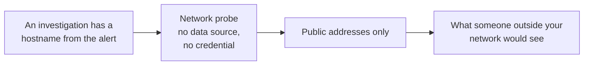
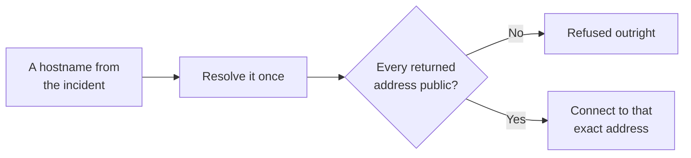

# Network probe

**There is nothing to set up.** No credential, no address, no wizard. Every tenant gets exactly one
network probe, built in, and its tools are available to an investigation straight away.

It answers the most basic triage questions about a hostname the platform found in an alert: is this
host reachable, is its certificate valid, and does its name resolve to what you expect.

## What it adds to an investigation

This is what separates "our service is broken" from "our DNS record is pointing at nothing".

## How it is wired

One path, and it is the only connector with nothing to configure. There is no data source to create
and no credential to store, because it holds no access to anything of yours. It reaches only public
addresses, which is what makes that safe.

## Before you start

Nothing. It is on.

The **Add connection** catalog deliberately has no card for it, because a configurable copy would
be misleading and could duplicate the built-in. It polls nothing, and it has nothing to look at until
an investigation names a host.

## What it can do

--8<-- "_generated/connector-tools/networkprobe.md"

One connection per call, with no ranges and no loops, so the tools cannot be used to scan a network.
Timeouts are short: three seconds for a name lookup, five for a connection or a certificate check,
eight for an HTTP request.

The target can be a hostname or a public IP address. A private or metadata address is refused either
way.

## Public addresses only, and why that matters here

Every other connector points at one server you configured. This one points wherever the incident
says, which makes a hostname that resolves to an internal address the main threat rather than an
edge case.

It never looks the name up a second time. That closes the gap a general address check cannot: a name
whose DNS answer changes between the check and the connection cannot land on an internal address,
because the address that was checked is the address that gets dialled. An answer mixing a public and
a private address is rejected outright, so there is no picking the safe-looking one.

Refused in all cases: loopback, private ranges, carrier-grade NAT, cloud metadata, unique-local,
link-local, and every way of writing an IPv4 address inside an IPv6 one.

Your egress rules remain the backstop. See [Network policy](../operate/network-policy.md).

## Why the certificate check accepts a bad certificate

Its entire purpose is to diagnose **broken** certificates. Refusing to complete the handshake would
fail on exactly the expired, self-signed, and wrong-host certificates you are trying to look at.

So the handshake completes regardless, and the verdict is reported as data: whether it was trusted,
and if not, why. Nothing is sent over that connection, no credential and no request body, so
completing it exposes nothing.

## Why the HTTP check also accepts a bad certificate

An HTTP check against an `https` address has the same need: it should still return a status when
the certificate is expired or self-signed. So it completes the handshake either way, and returns the
certificate verdict next to the status and headers.

That verdict matters here, because this check does send a request. A certificate that does not
verify may belong to something intercepting the connection rather than the host, and then the
status and headers prove nothing. Read them as unconfirmed whenever the verdict says the certificate
was not trusted.

The path and query are never sent to a peer whose certificate did not verify. A URL copied from an
incident can carry a credential in either place, such as a signed download link, a `token`
parameter, or a webhook address with the secret in its path. The check requests `/` instead and says
so in its result. The status it returns is for `/`, not for the URL you gave, so the topology view
does not show it against that URL.

A plain `http` address has no certificate to check. It sends the full URL as given, the same as any
client would.

## Secrets in results

There is nothing to redact. The connector calls no authenticated API and returns no response body.
Headers are metadata. A session cookie from an anonymous request is not a secret, and is covered by
the platform's general redaction anyway.
