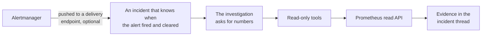
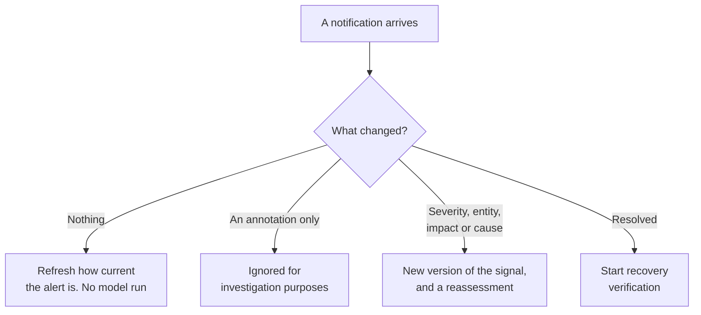

# Prometheus and Alertmanager

Reads your Prometheus over its HTTP API. Alertmanager delivery is a separate, optional capability on
the same connection: Alertmanager posts notifications to an endpoint belonging to this connector,
and those become incidents.

The read credential and the delivery credential are different. A Prometheus API credential is never
reused to authenticate anything inbound.

## What it adds to an investigation

Two things, and they are independent. **Reading** lets an investigation ask your metrics questions.
**Delivery** lets a firing alert open an incident that already knows when it started and when it
cleared.

## How it is wired

Two paths, two credentials, and either one works without the other. Prometheus itself is never
polled: reads happen only while an investigation is running. Delivery is what gives an incident its
real firing and recovery times, rather than the time a human noticed.

## Before you start

| You need | Why |
| --- | --- |
| A Prometheus address the platform can reach | A private network address is allowed here |
| One authentication method, from the table below | Saving without one is rejected |
| Your certificate authority, for a self-signed certificate | Server trust is separate from authentication |
| An Alertmanager receiver you can edit, for delivery | Optional. You can connect reads only |

## Address and transport

Prometheus is self-hosted and usually lives on a private network, so a private address is allowed
here. Loopback, link-local, and cloud metadata addresses are refused. During local development the
supervised tunnel on `http://127.0.0.1:9090` is admitted; a deployed process never admits it.

Plain HTTP has no encryption and requires you to acknowledge that during setup. Use it only through
that tunnel or on a trusted private network, and use HTTPS whenever credentials or monitoring data
cross anything else. Mutual TLS requires HTTPS.

Requests carry the credential in a header and never in the address, time out after eight seconds,
and refuse redirects.

## Authentication

Prometheus has no single authentication convention, so pick the one your deployment uses.

| Method | What you supply | How it is sent |
| --- | --- | --- |
| None | Nothing | Unauthenticated, for a bare in-cluster Prometheus |
| Bearer token | A token | An `Authorization` header. Grafana Cloud, Thanos, an OAuth proxy |
| Basic | A username and password | An `Authorization` header. An nginx-fronted Prometheus |
| Custom header | A header name and value | That header. Cortex and Mimir tenant headers, API-key proxies |
| Client certificate | A certificate and key | Presented during the TLS handshake |

A client certificate over plain HTTP is rejected. Amazon Managed Prometheus, which signs requests,
is a documented future addition to the same set.

Server trust is separate, because a Prometheus behind basic authentication can still serve a
self-signed certificate. Pin your own certificate authority, or explicitly choose to skip
verification.

## Connect it

Open **Connections**, choose **Add connection**, then **Add Prometheus & Alertmanager**. Five
steps, and the last three exist only because delivery is optional. The catalog and the shape every
wizard shares are in [Set up a connector](setup.md).

### 1. Metrics endpoint

The address and the authentication method. A private network address is allowed here, because
Prometheus is usually self-hosted. The wizard says plainly that investigations query this endpoint
on demand and that nothing is polled or copied.

### 2. Metrics credential

The secret for the method you picked, plus a certificate authority if your server uses one. If you
chose no authentication there is nothing to enter.

### 3. Alertmanager delivery

Independent of reading, and genuinely optional. Choosing a delivery mode gives Alertmanager an
endpoint to post to, which is what lets a firing alert open an incident that already knows when it
started and when it cleared. **Configure later** leaves reading fully working and alerts simply not
arriving.

Once you pick a mode, the step also states the episode policy, because it is not something you
configure: each provider episode opens its own incident and its own Slack thread, and episodes that
arrive close together are compared afterwards rather than folded into one workspace.

### 4. Review

Settings only. Review does not save: the connector and any local relay change only after the next
step.

### 5. Verify

The credential is encrypted before it is stored. Verification runs a trivial query, and the
connector is switched on only if it succeeds.

This step runs against your real system, so it is not pictured here.

## What it can read

--8<-- "_generated/connector-tools/prometheus.md"

Nothing here can change anything. The two query tools send their parameters in a request body, which
avoids the length limit on long queries, but they post to one fixed read path. The general-purpose
tool is read-only, confined to the API path, and normalised so that a relative path cannot escape
it. No tool accepts an HTTP method, and the endpoints that would delete data need methods no tool
can use.

Time ranges accept either an exact timestamp or a relative expression such as `now-1h`, anchored to
when the incident started.

## Alertmanager delivery

During setup you choose how notifications reach the platform: a public HTTPS endpoint in a deployed
environment, a relay in local development, or nothing at all. Choosing nothing is valid, and the
connector card then says event delivery is not configured rather than looking complete.

You get a copyable block to add to the Alertmanager receiver that already routes the alerts you care
about. Add it to that receiver. Do not change its name, its Slack configuration, or your routing
tree.

Saving stores a draft that is switched off. A successful verification switches it on and starts
delivery. The connector card reports read access and delivery health separately, so a connection
that can only query cannot appear fully configured.

The endpoint rejects anything unauthenticated, malformed, oversized, truncated, or of an unexpected
version.

### What a notification does

A grouped notification is split into separate alerts. Each one is identified by the connection it
came from, Alertmanager's own fingerprint, and when it started.

A reassessment is narrow when the incident already has a trusted assessment, and complete otherwise.
If the very first notification is already resolved, the platform still assesses it and then
schedules the recovery check.

Labels are read for what they honestly are. A job name is monitor scope and a namespace is runtime
scope; neither is promoted to a service in your catalog. You can map a candidate to a catalog
service yourself, and doing so does not rewrite what the provider actually said.

### A new alert always gets a new incident

A new start time creates a new alert episode, independently investigated incident, and Slack thread.
The earlier occurrence remains recurrence history. Matching monitor identity and arrival time never
reuse its workspace.

### Alerts that arrive together

Alerts from the same connection inside one burst window, 120 seconds, are grouped as a cohort.

A cohort seals its members before analysis and exposes at most five independent incidents to one
budget-admitted model call. It can record only a possible relationship or that two incidents are
unrelated. Timing never proves a cause and never merges records.

A possible relationship starts one focused causal reassessment. The platform creates a directed
cause only when a conclusive investigation cites durable evidence, meets the confidence threshold,
and the candidate is still current. Each symptom can have one direct cause and the graph cannot
contain a cycle. The direct cause owns coordinated recovery and lifecycle; every incident keeps its
own evidence, conversation, and Slack thread.

You can merge incidents only after both investigations finish, and only with a reason and evidence.
Splitting them again restores the original signals, threads, and states. Every causal, unrelated,
merge, split, and rejection decision remains in the audit trail.

### Live Alertmanager and Slack acceptance

The repository acceptance harness starts a pinned official Alertmanager against an empty isolated
database and a fake investigator. It verifies exact-repeat suppression, one material reassessment,
resolved and refired episodes, bounded cohort analysis, an evidence-backed causal response root,
complete-group recovery, binding-scoped Slack receipts, and reversible merge and split. The harness
closes its synthetic incidents and fails if any run-owned container cannot be removed.

## Secrets in results

This connector has no redaction rules of its own. Prometheus already masks structured credentials in
its own configuration endpoint.

The residual case is a credential written into an address, such as a username and password in a
scrape target, which is
[known Prometheus behaviour](https://jfrog.com/blog/dont-let-prometheus-steal-your-fire/). That is
the same limit that applies to any log line. Your egress rules and per-customer credential isolation
remain the real controls.
