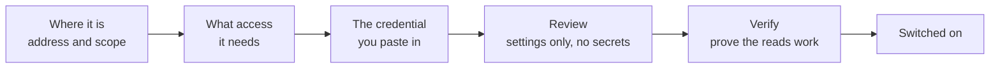

# Set up a connector

Every tool is connected from the **Connections** page in the dashboard. There is no configuration
file to edit and nothing to redeploy. The shortest connection takes three steps, the longest takes
five, and the wizard tells you exactly what to create in the other tool before it asks you for
anything.

## Start from the catalog

Open **Connections**, choose **Add connection**, then press **Add** followed by the provider name on
its card, for example **Add Grafana**. Once you have one connection of that provider the card reads
**Add another Grafana** instead. Search by name or capability, or filter by category; each card shows
how many connections you have configured already.

Read **Before you start** at the top of the wizard, then expand **Step-by-step setup instructions**
for the provider-side steps, the credentials to copy, and the checks that prove the connection
works. The progress indicator shows your current step and the total number of steps.

## Every wizard has the same shape

The progress bar across the top of the wizard names the steps for that particular tool, so you can
see how far you have to go before you start.

The middle steps differ because the tools differ. What does not differ is that the last two steps
are always **Review** and **Verify**.

## What Review and Verify actually do

**Review** shows the settings you are about to save and nothing else. Credentials never appear here,
because they are never readable once submitted.

**Save and verify** writes the settings, stores the credential encrypted, and then performs the
exact reads the platform will later depend on, against your real system. The connection is switched
on **only if those reads succeed**. If a permission is missing it tells you which one, at setup
time, rather than failing silently inside an incident three weeks later.

The success message names what was read, for example **Read access verified** for GitLab or
**Prometheus metrics verified** for Prometheus. It does not prove incoming events are working.
Confirm the first authenticated delivery on the connection details.

That relationship holds afterwards too. Verification runs again when you press **Retest**, and a
check that fails switches the connection back off rather than leaving it to return partial
evidence.

## Every step is pictured

Each connector page walks its wizard one step at a time, with a screenshot of each screen and what
that screen is asking you for. The one exception is the final **Verify** step of each wizard, which
runs against your real system, so it is described rather than pictured.

## What you need before you open a wizard

Each connector page lists its prerequisites in a **Before you start** table, so you can gather the
token or the address first and finish the setup in one sitting. The pattern is almost always the
same: an address the platform can reach, and a read-only credential you create in the other tool.
Kubernetes generates a permissions manifest for you to apply, and GitHub is installed as an App
rather than authenticated with a token.

| Provider | Steps | Prepare | Guide |
| --- | --- | --- | --- |
| StatusCake | 3 | An API bearer token for your monitoring account | [StatusCake](statuscake.md) |
| Datadog | 4 | The correct site, an API key and a scoped application key | [Datadog](datadog.md) |
| Grafana | 4 | A Viewer service account token for the required organization and resources | [Grafana](grafana.md) |
| Kubernetes | 5 | Cluster access to install the generated read-only RBAC and service account | [Kubernetes](kubernetes.md) |
| Prometheus and Alertmanager | 5 | The endpoint's read credential; optional Alertmanager receiver administration | [Prometheus and Alertmanager](prometheus.md) |
| GitLab | 5 | Group-scoped Reporter access with `read_api`; separate hook-management permission for events | [GitLab](gitlab.md) |
| GitHub | 5 | A dedicated App, installation access, private key and webhook secret, or use the generated App flow | [GitHub App setup](github.md#existing-app-field-by-field-setup) |
| Argo CD | 5 | Project-role administration and a token for each selected project | [Argo CD](argocd.md) |
| Slack | Own guide | An App with Socket Mode, bot events, an app token and a bot token | [Connect Slack](../get-started/connect-slack.md) |

[Network probe](networkprobe.md) is not in this table because it is not in the catalog. It is built
in, has no data source and no credential, and is available to every investigation from the start.

### Reuse access you already have

You do not need to recreate an account or credential for every setup. Existing access must match
the provider, endpoint, organization, and permissions this connection needs. The platform does not
copy a secret from another connection or workspace.

| Provider | What can be reused |
| --- | --- |
| Kubernetes | Existing read-only service account and RBAC. Choose **Use existing access**; installed connections can keep their stored token and CA. |
| Argo CD | A dedicated project role with one token per selected project. Enter its role name; it must not already belong to another data source. The legacy `sre-platform` role remains reserved for existing connections. |
| GitHub | An existing dedicated read-only App and installation, not an App whose webhook serves another integration. |
| GitLab | A valid group-scoped Reporter token with `read_api`. Hook setup is separate. |
| Datadog | The API key and scoped application key pair. Leave both blank when editing to keep them; provide both when replacing them. |
| Grafana | A read-only service account token for the target organization. |
| Prometheus | The endpoint's existing authentication, including no authentication when appropriate. Alertmanager delivery remains separate. |
| StatusCake | A valid API token for the target account. |
| Slack | An existing App and its matching app/bot tokens, dedicated to this connection rather than shared with another active Socket Mode consumer. |

New credentials are needed when existing access is missing, expired, revoked, or does not have the
required permissions. Keep separate credentials where independent revocation or isolation is needed.

## Which address belongs in which field?

| Field | Enter | Do not enter |
| --- | --- | --- |
| GitHub or GitLab webhook URL | The complete generated URL, including the connector-specific path | Just the API origin or an invented connector ID |
| Smee channel URL | The full Webhook Proxy URL from a new Smee channel | A production API address |
| Kubernetes API URL | The target cluster's HTTPS API server address | A Kubernetes dashboard address or your kubeconfig file |
| Argo CD URL | The Argo CD HTTPS server address | An individual application page |
| Prometheus base URL | The Prometheus HTTP API base address | Alertmanager, a graph page, or a query endpoint path |
| Grafana base URL | The Grafana instance address | A dashboard link or Cloud metrics ingestion address |
| GitLab URL and group path | Instance URL and group path in separate fields | A whole project URL |
| Datadog site | The site hosting your Datadog organization | The region of the servers you monitor |

The platform server makes provider API requests. An endpoint that works in your browser may still
be unreachable from that server. Check routing, DNS, firewall rules, and certificate trust from the
platform's network. Do not disable certificate verification to solve a connectivity problem.

The platform's own API URL is deployment configuration, not a connector field. Public webhook
addresses are generated from that configuration for GitHub, GitLab, and Alertmanager. If no suitable
HTTPS address is configured, ask the platform administrator to correct it. Local development can
use a Smee relay instead. External provider URLs remain editable because they identify the system
you want to connect.

## Finish both sides of event delivery

GitHub, GitLab, and optional Alertmanager delivery require provider-side configuration as well as
saving in SRE Platform. Existing public GitHub and GitLab webhook URLs are available on opening
**Manage**. Alertmanager shows its URL in the delivery step, together with receiver setup guidance.
Use the **Copy** button; if the browser denies clipboard access, select and copy the displayed text.

For a new connection, the delivery step prepares the full URL before you save. Public delivery
allocates a connector-specific path; Smee creates a development channel automatically. Copy that
exact URL into the provider, finish saving in SRE Platform, then send or redeliver a test event.
Preparing a URL does not activate a receiver. Back/Next and save retries retain the address;
closing an unsaved setup discards it. Existing saved addresses remain unchanged. If preparation
fails, use **Retry webhook preparation**. GitLab's signed-hook
command and Alertmanager's receiver configuration include additional required settings; copying
only the URL does not replace those steps.

For a failed delivery, inspect the provider's delivery response and check the URL, TLS certificate,
network access, and matching secret.

Datadog, Grafana, Kubernetes, Argo CD, and StatusCake do not need incoming webhooks for these
connectors. Slack uses Socket Mode, so it does not need a public callback URL either. Valid Slack
tokens alone do not prove messages will arrive: subscribe to events, invite the bot, and select
the channels the platform should listen to.

## Adding a second one of the same tool

Choose **Add connection**, then **Add another** on the provider card. A provider that supports only
one connection shows **Already configured** instead. Each connection has its own credential, its
own scope, and its own status; the difference between a connector and a data source is explained in
[Connect your tools](index.md#connector-against-data-source).

Give them names you will recognise under pressure. The name is what appears beside the evidence in
an incident.

## Manage existing connections

The main page lists your saved connections, not every available provider. Search by connection
name, provider, or scope. Use **Needs attention** to find access checks or data delivery that need
review. A verified access check does not prove events or polling are working: the **Access** and
**Data activity** columns report them separately. No recent events alone does not prove a failure.

Open a connection to see detailed evidence, change its configuration with **Manage**, or **Retest**
access. Connection detail addresses can be bookmarked and shared with workspace members.
**More actions** contains **Disconnect**, which asks for confirmation. **Back to connections**
returns to your filtered inventory. What every status badge means is on the
[Connections page reference](../dashboard/connectors.md).

The polling snapshot count is the total returned by the last successful poll, not just deployment
records. For Kubernetes it includes pod and node snapshots. A successful empty poll reports zero;
a failed poll retains the previous successful count alongside the failure status.

Slack is available in the same catalog and inventory. Its detail view manages chat access and
channel subscriptions. **Inbound** focuses on channel subscriptions and message processing activity,
with a link back to connection settings.
Each evidence provider retains its own setup guide and verification checks.

## Editing and rotating credentials

Credentials are write-only. You can replace one, but the platform never shows it back to you, not
even partially, and stored credentials are not loaded into edit forms. Where a field says to leave
it blank to keep the credential, blank means unchanged, not removed. Do not copy secrets into a
ticket, screenshot, or source repository. Coordinate webhook-secret rotation with the provider so
both sides agree.

Disconnecting the platform does not revoke provider-side tokens, Apps, hooks, or RBAC. Follow the
provider guide to remove that access when it is no longer needed.

## Adding a tool that does not exist yet

Everything above is configuration. If the tool you need is not in the catalog at all, or a connector
you use is missing a read you want, that is a code change rather than a setup step. See
[Add a connector](../build/connectors.md).
