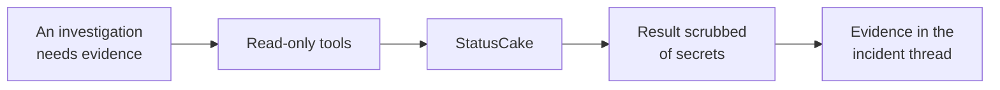

# StatusCake

StatusCake gives the platform an outside-in view: uptime, certificate, page-speed, and heartbeat
checks, and how long each has been failing.

That is the one thing your internal telemetry cannot tell you, whether the service is reachable from
outside at all.

## What it adds to an investigation

Uptime alerts can open incidents. You choose which tests take part, and the platform creates the
StatusCake contact groups that deliver their alerts. The platform verifies the exact test through
the StatusCake API and creates a visible Slack conversation before opening an incident. Other check
families remain investigation evidence only.

## How it is wired



Investigation reads are on demand. Bound open episodes are also reconciled periodically against provider history, independently of AI availability.

## Before you start

| You need | Why |
| --- | --- |
| One API token from your StatusCake account | Stored encrypted |

That one token is all the platform needs. It reads your tests and, when you turn on uptime alerts,
creates the contact groups that deliver them. No legacy username, legacy API key, or webhook Token
is needed.

The platform talks to `https://api.statuscake.com` and nowhere else, so your token can only ever be
sent to real StatusCake.

## Connect it

Open **Connections**, choose **Add connection**, then **Add StatusCake**. Three steps. The catalog
and the shape every wizard shares are in [Set up a connector](setup.md).

### 1. API token


Reuse a valid StatusCake API token, or create one under **Integrations** and **API**, and paste it.
**Save and continue** stores it encrypted and makes one listing request. A rejected token is reported as
exactly that, and you can paste a new one without starting over.

### 2. Notifications

Choose whether StatusCake alerts open incidents:

| Choice | What happens |
| --- | --- |
| **All uptime tests** | Recommended. Every test takes part, including tests you add in StatusCake later. Untick a test to leave it out. |
| **Only tests I choose** | Only the ticked tests take part. New tests wait until you select them. |
| **Off** | StatusCake is used only as evidence during investigations. |

The wizard lists your uptime tests with their current state. Search narrows the list, and **Select
all** and **Clear** apply to the tests the search shows. Choose the subscribed Slack channel where
incidents start, then **Save and set up**.

Uptime alerts need the platform's API to be reachable over public HTTPS, because StatusCake calls it
from the internet. When the deployment has no public HTTPS API address, only **Off** is available
and the wizard says why.

### 3. Done

The wizard lists each included test and what setup did for it, such as creating or updating its
contact group. If StatusCake refuses a change, for example at a rate or plan limit, setup stops,
shows StatusCake's reason, and offers **Retry setup**. Setup is safe to repeat: it continues from
whatever StatusCake already holds.

This step changes your real StatusCake account, so it is not pictured here.

## What it can read

--8<-- "_generated/connector-tools/statuscake.md"

Every tool is a read. The four kinds of check are structurally identical, so they share one tool
each with a check type chosen from a fixed list, rather than a dozen near-identical tools.

Collection reads use bounded page sizes. Uptime history, periods, and alerts use `limit`, `before`, and `after`; the time cursors are UNIX seconds. Lifecycle verification reads at most five pages and reports incomplete history rather than inferring recovery.

### What it looks at first

Before any model call, the platform pulls your uptime checks and keeps the failing ones, matching
them to the incident's service by name, tags, or address where it can. When nothing matches it shows
all the failing checks anyway, because "what is down right now" is worth knowing regardless.

## Secrets in results

What this connector reads is external monitoring data, not manifests or credential stores.

The contact groups the platform creates carry its webhook secret in their notification address.
Every read replaces that secret with `[redacted]` before an investigation sees it. A token in any
other contact group's address is left to the platform's general redaction, which catches it when it
is recognisable, the same limit that applies to any free-text field.

## Verified uptime recovery

StatusCake's alert does not say which test fired, so every included test needs its own address.
The platform handles that for you. For each included test it creates one contact group named
**SRE Platform:** followed by the test name, and adds it to the test. The group calls:

```text
/webhooks/statuscake/CONNECTION_ID/TEST_ID?Token=SECRET
```

The address supplies the test identity; notification names, URLs, status text, and diagnostic codes
do not. Code 0 is a supported timeout diagnostic and does not prevent lifecycle verification. The
secret is generated by the platform, stored encrypted, and kept across later saves so addresses
already in StatusCake stay valid. StatusCake contact-group addresses only support GET, so the secret
travels as the `Token` query parameter. Configure your reverse proxy to omit or redact it from
access logs. The application never stores the secret, notification URL, or raw payload in the
durable poll job.

Setup only ever touches contact groups it created: the name starts with **SRE Platform:** and the
address points at this connection. A group you made by hand is never changed or deleted, even when
it calls the same address; remove it yourself once the platform's group is in place. A test's other
contact groups, such as email or on-call contacts, are always kept: StatusCake replaces a test's
whole contact-group list on every change, so the platform reads the test's current list first and
writes it back with its own group added or removed. If that read comes back incomplete, setup stops
rather than risk dropping one of your groups. A group is deleted for a missing test only after
StatusCake confirms the test no longer exists, and an account with more than 2,000 uptime tests or
contact groups is refused rather than set up from a partial list.

While uptime alerts are on, the platform checks StatusCake about every five minutes. With **All
uptime tests** it sets up tests added since. In either mode it repairs a group whose address no
longer matches, and deletes its groups for tests you left out or deleted in StatusCake.

Turning uptime alerts **Off** removes every group the connection created; if StatusCake refuses part
of that, the background check keeps retrying until none remain. The dashboard and the background
check never run setup at the same time. Disconnecting the connection leaves its groups in
StatusCake, so turn uptime alerts Off first to remove them.

Each check lists your tests and contact groups, a handful of requests, which
stays well inside StatusCake's limit of 60 requests a minute on free plans. A check that hits a limit
stops and continues on the next one.

An authenticated notification persists a wakeup and returns `202 Accepted` without reading the
provider. Each notification keeps its own wakeup, which reads only the notified test and never runs
the whole-connection reconcile, so repeated notifications cannot multiply whole-connection provider
reads. The existing poll worker verifies the wakeup and retries provider reads without AI; its
outcome appears in the connection's delivery diagnostics, not in the webhook response. Actual period
or alert-history timestamps establish the episode; receipt time is only a history lookup point.

A notification never clears a signal by itself, and that includes Up. Recovery of a bound episode is
applied by scheduled reconciliation, which runs about every 30 seconds and works through bound
signals in bounded batches of 50 per pass, so a recovery can appear one or more poll cycles after
StatusCake reports Up. Recovery requires matching completed period evidence. A newer refire remains
active.

Prefer these bound notifications and the platform-created Slack thread for future episodes.
Independent stock Slack alerts lack a durable test ID and cannot be safely deduplicated by name or
URL. Disable redundant stock Slack delivery when switching to the bound route, after verifying the
new connection and destination. Stock notices that cannot be matched as described below require an
explicit binding. See [Connections](../dashboard/connectors.md#alert-lifecycle-and-existing-incidents).

### Stock Slack uptime notices

StatusCake's own Slack integration posts notices such as `went Down [Timeout / Connection Refused]`
or `went Up [HTTP 200] [Successful Connection]`. The platform reads the state and the checked URL
from them, whatever bracketed reasons follow. Slack text alone never changes an incident's
lifecycle, because anyone in the channel can post the same words.

The notice carries a URL but no test ID, so scheduled reconciliation uses the URL for one thing only:
choosing which test to ask StatusCake about. The rule is:

1. The URL in the notice and each uptime test's configured URL are put in standard URL form, which
   lowercases the scheme and host, drops a default port and turns an empty path into `/`. Nothing
   else is rewritten, so a different scheme, port, path, query or trailing path still differs.
2. Exactly one uptime test in the connection must match. No match, several matches, or an
   inventory larger than five pages of 100 tests leaves the notice unbound with one visible note on
   the incident.
3. StatusCake itself must then report one outage for that test, with a start, covering the moment
   the platform first saw the notice. Otherwise the notice stays unbound.
4. If another signal already holds that outage, the notice is left alone and noted, never bound twice.

A notice that passes all four is bound to that outage and the incident records which test and
outage start were used. From then on it is reconciled exactly like a natively bound episode: its
signal clears only when StatusCake reports the outage ended. Automatic matches do not count
toward the 50 explicit bindings a connection can hold. A connection change, rotation or disable
while the match is being checked discards it; the next pass tries again under the new configuration.

StatusCake can post several Down notices for one outage, and only one of them can hold the outage.
When StatusCake reports that outage ended, the platform also clears the other unbound notices on
the same incident that name the same URL and were first seen between the outage's start and end.
A notice seen outside that window belongs to a different outage and is left to bind its own. The
duplicates stay unbound. Under the default verified recovery policy the recovery check starts once
every notice is cleared. Under **Provider signals clear**, automatic closure still requires every
signal to hold its own provider episode, so an incident with cleared duplicates reports that
provider recovery is not established; select verified recovery for it instead.

Two answers are remembered for ten minutes per connection configuration, so a notice that cannot
bind asks StatusCake at most once in that time rather than on every pass:

- A URL that matched no test, or several. Adding or fixing a test can take up to ten minutes to
  take effect.
- A notice whose one matching test reported no single outage covering it, no retained outage
  start, or an outage another notice already holds. A duplicate of that outage on the same incident
  still clears when the outage ends, because clearing duplicates does not wait for this answer to
  expire. A duplicate on another incident is not cleared with it; it stays unbound and is checked
  again once the ten minutes pass.

A failed read of your StatusCake tests or of an outage is never remembered and is retried on the
next pass.

Delivery diagnostics distinguish a retryable in-progress post from a channel that is not subscribed
and from an uncertain Slack post. Subscribe the configured alert channel before replaying a retained
wakeup. For an uncertain post, inspect the existing intake and Slack root first; replay never creates
a second root while that uncertainty remains. Retained wakeup jobs contain the connector, exact test,
receipt time and configuration generation, never the webhook Token or raw form/query payload. A
binding, or a re-verified connection save, after receipt does not discard a retained wakeup; it is
read under the current configuration, and only if that configuration still delivers events for the
same test. A saved connection stays disabled until it is verified again, and a wakeup processed in
that gap is discarded.

Delayed Down retries retain the alert-history trigger timestamp, even when the completed downtime
period began earlier. A current Up check with no matching new outage completes the wakeup without
creating or resolving a signal; scheduled reconciliation of the bound episode applies recovery.
Missing or exhausted history for an exact episode remains unverified.
