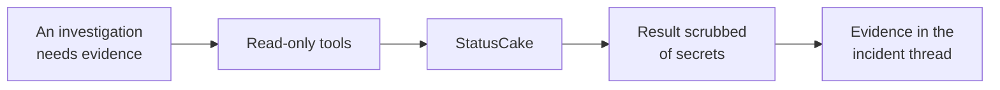

# StatusCake

StatusCake gives the platform an outside-in view: uptime, certificate, page-speed, and heartbeat
checks, and how long each has been failing.

That is the one thing your internal telemetry cannot tell you, whether the service is reachable from
outside at all.

## What it adds to an investigation

Alerts do not arrive through it. They arrive in Slack, like every other signal.

## How it is wired

One path. Nothing is polled and nothing is pushed, so between incidents the platform sends StatusCake
no traffic. Its value is the outside view: it is the only source that is not measuring your systems
from inside your own network.

## Before you start

| You need | Why |
| --- | --- |
| One API token from your StatusCake account | Stored encrypted |

The older API, with a username and an API key, is not supported. The current one does not accept it
either.

The platform talks to `https://api.statuscake.com` and nowhere else, so your token can only ever be
sent to real StatusCake.

## Connect it

Open **Connections**, choose **Add connection**, then **Add StatusCake**. Three steps, the shortest
setup in the product. The catalog and the shape every wizard shares are in
[Set up a connector](setup.md).

### 1. API token

Reuse a valid token, or create one if needed, that can read uptime tests, history, alerts, maintenance windows, and contact groups,
then paste it. The wizard lists where to find it in StatusCake.

### 2. Review

The pinned API host, whether the credential is new or kept, and the access mode. Saving creates a
disabled draft.

### 3. Verify

Makes one trivial listing request. A success switches the connector on. A rejected token is reported
as exactly that.

This step runs against your real system, so it is not pictured here.

## What it can read

--8<-- "_generated/connector-tools/statuscake.md"

Every tool is a read. The four kinds of check are structurally identical, so they share one tool
each with a check type chosen from a fixed list, rather than a dozen near-identical tools.

Paging is driven by the model: each listing accepts a page number and a page size, capped at 100 and
defaulting to 25, and returns the total count so the model can ask for the next page itself instead
of the connector walking your entire history.

### What it looks at first

Before any model call, the platform pulls your uptime checks and keeps the failing ones, matching
them to the incident's service by name, tags, or address where it can. When nothing matches it shows
all the failing checks anyway, because "what is down right now" is worth knowing regardless.

## Secrets in results

This connector has no redaction rules of its own, and does not need them. What it reads is external
monitoring data, not manifests or credential stores.

The one residual case is a token embedded in a contact group's notification address, which the
platform's general redaction catches when it is recognisable. That is the same limit that applies to
any free-text field.
