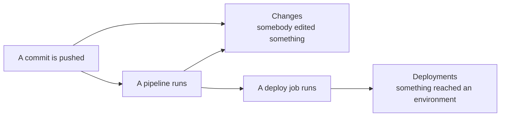

# Changes

Source-control activity: commits, merge requests, pipelines, and releases, from GitLab and GitHub in
one list.

## Four categories

| Category | Covers |
| --- | --- |
| **Code** | Pushes and tag pushes |
| **Review** | Merge requests and pull requests |
| **CI** | Pipelines and jobs, with their outcome |
| **Release** | Published releases |

One feed, both providers. During an incident you are asking "what changed", not "what changed in
GitLab specifically".

## Filters

Provider, repository, category, status, time window, and free-text search. Status has three useful
groupings rather than a list of every vendor word: **failed** collects failure, error, cancelled and
timed out; **success** collects succeeded, passed, completed and merged; **active** collects running,
pending and queued.

## Changes and deployments are different lists

This is a deliberate split, and it trips people up.

**Changes** is what people did. **Deployments** is what reached an environment. A merged request that
never deployed appears in one and not the other, and during an incident that difference is the whole
question.

## Disconnected sources

An event whose data source has since been removed still appears, labelled as coming from a
disconnected source. History is not rewritten when you disconnect a tool.
