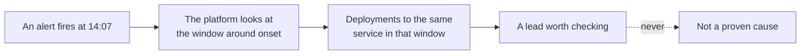

# Deployments

What shipped, where, and whether it worked.

## What counts as a deployment

A release event from any source that reports one: a GitOps sync, a pipeline deployment job, a
platform deployment event. They are shown in one list rather than one tab per tool, because during
an incident you want the timeline, not the vendor.

## Reading a row

| Column | What it tells you |
| --- | --- |
| Status | Succeeded, failed, or still running |
| Service and repository | What was deployed, and from where |
| Environment | Production, staging, or a temporary environment |
| Reference and revision | The branch or tag, and the exact revision |
| Actor | Who or what triggered it |
| Time | When it happened |
| Budget | The error budget the service had left when the deploy landed, and a high risk note when it was nearly spent. Advisory only: the platform reports the risk and never stops a deploy. Shown once at least one deployment in view carries a figure |

## Filters

Filter by service, environment, source, status, and time window, or search across the row. Filtering
is done by the server, so a filter applies to your whole history rather than to the page you have
loaded.

**Load older** walks backwards through history. The list does not renumber underneath you when a new
deployment arrives mid-scroll.

## Why this page exists

Deploy correlation is the second step of every investigation, right after blast radius. Most
incidents follow a change, so "what changed just before this started" is the highest-yield question
available.

The platform is careful about the word. A deployment that lines up in time is **evidence of
proximity**. It says so, and it keeps looking.

## Evidence ledger

An incident opened from a deployment keeps the deploy record it was opened from, so the timeline
stays readable months later when the deployment history has moved on.
