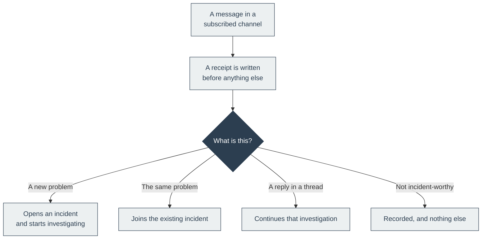

# Inbound

Which Slack channels the platform listens to, and what happened to every message it saw. Any member
can read this page. Adding or pausing a channel is reserved to a workspace owner or admin, as are
the connection controls this page links to: editing, rechecking and disconnecting Slack.

This page is a reference for what the screen shows. The step-by-step setup, including how to pick
channels and why a newly invited channel can take up to five minutes to appear, is
[Connect Slack](../get-started/connect-slack.md).

## Slack intake

The strip at the top names the surface (**Slack**) and shows its access state in one line. The
controls beside it:

| Control | Does |
| --- | --- |
| **Connect Slack** | Shown before Slack is connected. Opens Slack under **Connections**, where the setup wizard runs. |
| **Manage Slack connection** | Shown once Slack is connected. Opens the same place, for the connection details described [below](#slack-connection-details). |
| **View signals** | Opens the [Signals](signals.md) page. |

Before anything is connected, the page reads **Connect a chat tool to get started.** If credentials
exist but the bot token is not usable yet, the subscription list is replaced by **Channel
subscriptions need Slack access.**

## Message activity

**Message activity** is a collapsible card. Collapsed, it shows **Latest event:** followed by the
outcome wording from the [table below](#what-happened-to-the-last-message), plus two counts:

- **`N` messages pending**, still being decided.
- **`N` failed or retrying in the last 24 hours**.

Expand it for the one-line explanation of the latest outcome and its timestamp. Before the first
message arrives it reads **No inbound events recorded yet.**

## Channel subscriptions

The subscription list shows every channel the platform knows about with its status, **Listening** or
**Paused**. Search by channel name, or filter with **All channels**, **Listening**, or **Paused**.

| Control | Does |
| --- | --- |
| **Add channel** | Opens Slack's channel directory on demand (this is the only action that asks Slack for the list). Select a channel and confirm **Add**. The channel appears as **Listening** only after the save succeeds. |
| **Listen** checkbox | Clear it to pause new intake from that channel without disconnecting Slack. Tick it to resume. |

Subscribing a channel is the opt-in. There is no separate inbound switch, and a message from an
unsubscribed channel is recorded as **Channel not subscribed** and goes no further.

A failed update keeps the last confirmed state and shows a retryable error rather than claiming the
update succeeded.

Notices you may see inside **Add channel**:

| It says | Means |
| --- | --- |
| **No channels visible to the bot yet. Invite it to a channel first.** | Slack returned an empty list. A private channel appears only after the bot is invited to it. |
| **The Slack channel list is truncated. Some channels may be missing.** | The bot can see more channels than the platform pages through. Invite the bot to the channel you need rather than searching for it. |
| **Slack rejected the request: missing_scope. Add these scopes to the Slack app and reinstall it: …** | A permission is missing. The message names the scopes Slack asked for, and the ones the bot token currently has, instead of showing an empty list. |

## What happened to the last message

Every envelope Slack delivers gets a durable receipt, including the ones the platform decided not to
act on. This is what answers "why did nothing happen when that alert fired". The outcome line reads
as one of these:

| It says | Means |
| --- | --- |
| **Incident opened** | The message started an investigation |
| **Added to an incident** | It was correlated with an investigation already running |
| **Recorded, no investigation** | The classifier judged that no incident response was needed |
| **Responder request queued** | A thread reply was accepted for the active investigation |
| **Interaction processed** | A button press was applied to its incident |
| **Interaction rejected** | That Slack identity is not authorized to act on the incident |
| **Incident reopened** | New evidence reopened the investigation |
| **Classification queued** | Accepted, waiting for the classifier |
| **Message queued** | Accepted, but processing has not recorded an outcome |
| **Processing message** | Processing has started without a recorded outcome yet |
| **Channel not subscribed** | It arrived from a channel you have not opted in |
| **No incident action** | It matched nothing: no alert, no tracked thread, no interaction |
| **Untracked thread ignored** | A reply in a thread that is not attached to an incident |
| **Edit ignored** | An edited message that is not attached to a tracked incident |
| **Recovery reported** | A bot recovery notice linked to the one open incident whose alert it names; a responder confirms resolution from that incident |
| **Resolution not matched** | A recovery notice that matched no single open incident, an edit of a tracked message, or a suggested resolution, logged without changing any alert; only connector-verified or native provider evidence clears one |
| **Duplicate ignored** | Already recorded |
| **Duplicate mention ignored** | The same responder mention was already accepted |
| **Deleted incident ignored** | It belongs to an incident that is no longer available |
| **Control notification suppressed** | The adapter recognised a provider control notification nobody needs to act on |
| **Classification superseded** | A newer decision about the same message stopped classification before routing |
| **Unsupported Slack event** | The event type is not one incident intake accepts |
| **Retrying delivery** | Being retried, with the attempt number |
| **Delivery failed** | Retries are exhausted; the line shows the attempt count and error code |

Anything the panel does not have wording for reads as **Processed**, with the recorded outcome
spelled out, rather than being hidden. In particular, once classifier enforcement is on, a message
routed to a ticket or to logged context has no wording of its own yet: it reads **Processed** with
**Recorded outcome: ticket** or **Recorded outcome: log**. This card does not otherwise separate
ticket from log. The [Signals](signals.md) page lists tickets and logged context on separate tabs,
and [Signal control](../understand/signal-control.md) explains the difference.

**Recorded, no investigation is not a failure.** Not every message deserves a page, and deciding
that cheaply is the point. What matters is that the decision was recorded rather than silently
dropped.

The receipt holds envelope metadata only: which channel, which kind of event, what was decided,
when. **It does not store the message text.**

## How a message becomes an incident

The receipt is written **first**, before the platform decides anything. That ordering is what makes
this page trustworthy: a message cannot be processed without leaving a trace, even if the processing
fails.

## Slack connection details

**Manage Slack connection** opens Slack under **Connections**. The card there is titled **Slack
connection** and carries a status chip:

| Chip | Means |
| --- | --- |
| **Connected** | The Socket Mode connection is up. |
| **Reconnecting** | The connection is being established or re-established. |
| **Connection unavailable** | Both tokens are stored but the live connection is not up. |
| **Configured** | Both tokens are stored and no live connection state has been reported yet. |
| **Needs configuration** | One or both tokens are missing. |

Stored credentials and a working connection are separate facts, and the chip keeps them separate so
you can tell a wrong token from a network problem. The card also repeats **Latest event:** and the two
counts from **Message activity**. It never shows token values.

| Control | Does |
| --- | --- |
| **Edit Slack** | Reopens the setup wizard. A blank field leaves the stored token untouched, so you can replace one token without re-entering the other. **Save and verify** with both fields blank re-checks the stored tokens; see [Rechecking the stored tokens later](../get-started/connect-slack.md#rechecking-the-stored-tokens-later). |
| **Disconnect** | A hard delete, after the confirmation **Disconnect Slack? Inbound channel subscriptions will be disabled.** It pauses every subscribed channel, stops listening, deletes both tokens, and marks anything still queued to send as blocked so it is not retried. Channel names are kept so that reconnecting later shows you familiar names, but nothing else survives, and a reconnect does not re-enable the paused channels. |
