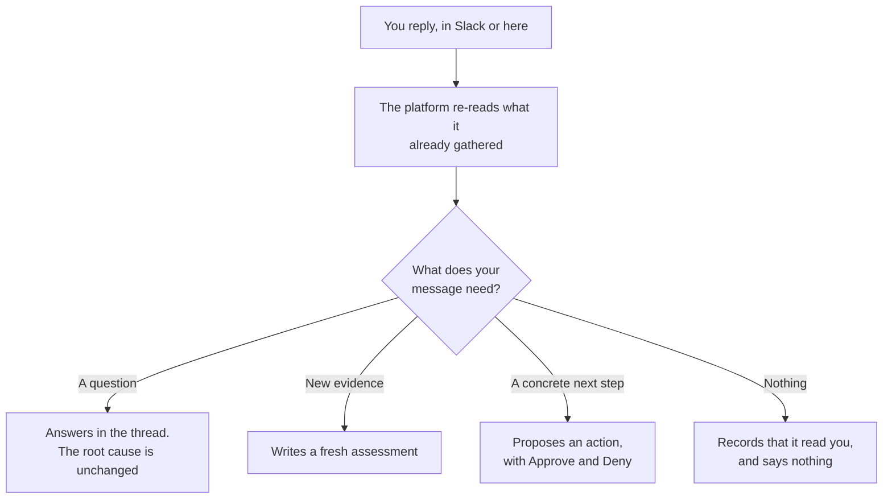

# Incident workspace

Start with the reported impact, evidence freshness and next action. The assessment, supporting
evidence and shared conversation stay on one page.

## Triage at a glance

| Section | Contains |
| --- | --- |
| **Brief** | Recorded impact, leading hypothesis, contradictions, missing information and next step |
| **Conversation** | Every message, from Slack and from here, in one thread |
| **Supporting evidence** | A compact set of cited checks, or explicitly labeled recent checks |

## Human decision required

The decision names the recorded next action. Service team is ownership context, not an assigned
incident commander. Missing team or impact stays explicit. Check contradictions before acting.

When a provider bot posts a recovery notice in Slack for this incident, the platform records it as
a report. A provider that edits its alert message so it opens with a resolved header covers every
alert in that message, until the provider edits that message again. An edit that only lists some
alerts as resolved covers the one alert it matched. A new recovery message covers only the alert
it names; if one new message names several alerts, only one of them is covered, so the panel does
not offer confirmation. Slack text cannot clear an alert, so the platform does not resolve the
incident on its own. When every open alert has a report and the incident is open or mitigated, the
panel offers **Confirm resolved**. If a human decision is also required, the decision reads
**Provider reported recovery in Slack. Confirm resolution.** Confirming resolves it and records
that an operator confirmed the reported recovery, with the time of the notice.

## Automation policy

What the platform is allowed to do on this incident: whether a provider episode boundary is
recorded, and how much of the automatic investigation budget this incident has used.

## Recorded state, not assumed progress

Incident lifecycle, provider notifications, recovery evidence and automation are separate facts.
Cleared alerts do not prove user recovery. A queued or processing job describes a stored work
record, not proof that a worker is making progress. A scheduled check can be overdue.

| Panel | Answers |
| --- | --- |
| **Response status** | Whether human attention is required and the recorded lifecycle |
| **Provider notifications** | Is the underlying alert still unresolved |
| **SRE investigation** | Recorded work and the separately timestamped last completed result |
| **LLM usage** | What this one incident has cost |

History, policy and accounting remain in disclosures. An interrupted live stream is shown beside
the situation. You can keep editing a draft while disconnected, but must reconnect before sending.
New updates offer explicit navigation without moving your reading position.

## Inspect evidence

Open a citation to inspect its exact check, including one outside the loaded evidence page.
**All evidence** opens the loaded ledger. Search, source and outcome filters apply only to loaded
records; **Load older evidence** fetches another page. **Data returned** is not proof of a diagnosis.

The wide inspector shows a chart, facts or logs before raw stored input/output. Long content uses
pages instead of nested vertical scrollers. Projection limits are disclosed; stored output is not
the provider's complete history. **Back to evidence** retains filters. Close or Escape returns to
the incident without discarding the draft.

On tablet and mobile, the workspace stacks by available width. Situation and next action stay ahead
of supporting evidence and conversation. The same inspector keeps Back and Close available.

## Responder brief

The recorded assessment, with its timestamp. Its observation window may be older than the page.

- **Model confidence** is a self-reported number out of 100. It falls when evidence is thin or a
  step could not run. Treat it as the platform's own hedging, not a probability.
- **Impact** is who is affected.
- **Leading hypothesis** is the most likely cause, and **Full assessment** expands to the ranked
  alternatives with the evidence for and against each one.

When newer recovery evidence controls the brief, retained impact is labeled **Impact at last
assessment** with the assessment timestamp. This historical impact does not establish current
impact or imply that impact is zero. Health checks retain their assessment context.

Only a conclusive investigation becomes the trusted assessment. An inconclusive run is recorded and
visible, but it does not overwrite a good earlier answer.

Current work is separate from the last trusted assessment. A queued or running follow-up does not
make the earlier answer current. A failed follow-up leaves its failure visible and preserves the
earlier assessment and evidence. Delivery status describes whether a message reached Slack, not
whether the investigation succeeded.

Before publishing a conclusion, the platform reviews it against the recorded evidence. Historical
successful builds do not establish current health, and a mirrored repository does not establish
which revision was deployed. Missing or contradictory evidence leaves the result inconclusive.
Repository paths, resource names, and commands are preserved; credentials are redacted.

For an inconclusive run, **Latest investigation result** shows the reviewer's conclusion, limited to
facts the evidence supports, and a **Still to verify** list of open checks. The next diagnostic step
comes from the reviewer when the incident has no trusted next step. None of this becomes the trusted
assessment, and the run has no hypotheses or model confidence.

Replies keep the requested answer or document when evidence review corrects an unsupported claim.
The full corrected reply remains in the dashboard even when the diagnosis is inconclusive; Slack
receives a concise summary and incident link. This does not replace the trusted assessment.
Recovery advice is reviewed too. A later observation does not erase an earlier measurement from a
different time window. Evidence searches match individual terms; an empty search is not proof that
the incident has no relevant evidence.

Large evidence is reviewed in up to six source-linked chunks, then synthesized only after complete
coverage. The limit is 480,000 serialized evidence characters and seven calls sharing the original
deadline. Budget, timeout, malformed-output and citation failures report incomplete review, not a
detected contradiction. Unchecked procedures are withheld; durable evidence remains available.

## Capture guidance for next time

An active, linked workspace member can ask, “Create a runbook from this incident.” The platform
queues knowledge capture and posts the saved document in the conversation. Duplicate delivery of
the same request does not create another job. A withdrawn request is not permission to save it.
If newer conversation context arrives before the save commits, capture stops and asks you to
request it again. The saved document is posted again safely if delivery is interrupted.

With a confirmed remediation, the result is a runbook awaiting human review. Without a confirmed
fix, it is an investigation note with diagnostic guidance and explicit open questions, not a
proven remedy. Both are searchable in later investigations. Saving knowledge does not change the
incident lifecycle, modify infrastructure, or commit a file to a repository.

Slack receives a concise takeaway and an incident link; the complete document remains in the
conversation. Ask a follow-up there to discuss the guide without restarting the diagnosis.

An unsupported request to write a repository document may offer platform
knowledge capture instead. Only the requesting member can confirm that saved offer with **Yes**,
within 15 minutes. **No** cancels it; other input supersedes it. Old assistant prose is not consent.
Explicit requests to save a platform guide still run directly, without this extra confirmation.

## Repository issues

Open **Issues** on an incident to read, create, edit, close or reopen GitHub and GitLab issues.
Choose a connection and repository, then load recent issues or enter an exact issue number.
Lists contain at most 50 recent results. Permanent deletion is not supported.
Descriptions are limited to 20,000 characters; manage longer issues in the provider directly.

Changes require an administrator to enable issue management for specific repositories in the
connection. Prepare the fields, choose **Review changes**, inspect the saved preview, then choose
**Publish issue** or **Save changes**. Only the requesting active workspace member can confirm it.
Check the saved connection and destination URL, especially when instances share repository paths.
**Discard draft** makes no external change. Previews expire after 15 minutes.

You can also ask in the conversation, for example, “Create a GitLab issue in team/service with
the diagnostic findings.” Include the connection and full repository path; include the issue
number for an update. The platform prepares a preview, not a write. Confirm using the exact
`Confirm issue <draft ID>` command shown in its reply, or use the Issues panel. Bare “Yes” is not
issue authorization. Newer conversation input blocks a queued confirmation.

The platform rechecks membership, connection permissions and the issue's saved snapshot before
dispatch. A changed issue needs a new preview. This check cannot prevent another editor changing
the issue between the read and the provider's write. GitLab also checks the live project identity
and path before writing; a concurrent transfer after that check remains a provider-side race.
Only requested fields are sent.

Each preview allows one dispatch attempt. If the outcome is **unknown**, inspect the issue in its
provider and refresh status before preparing another change. The platform never automatically
retries an uncertain write or a rate-limited request. Results stay in the incident conversation.

## Lifecycle requests and health checks

An active workspace member can ask to close or reopen the current case in the conversation, for
example, “Please close this incident.” The platform records an attributed lifecycle receipt after
the change commits. Advice such as “Should we close?”, quoted instructions, conditional requests,
and references to another case do not authorize a change. The lifecycle controls remain available.

Closing a case does not verify recovery, silence a monitor, or discard evidence. A later question
continues the conversation without reopening it. New responder context arriving during a run is
kept for the follow-up; an outdated draft is not published as the current answer. A cancellation
received before a pending lifecycle action commits prevents that stale action.

A general health check uses the same conversation and evidence workspace, labeled **Health check**.
Use **Complete health check** when finished. Completion is not an outage resolution and does not
claim recovery. Health checks remain in the shared list but do not count as outages in operational
or reliability totals.

## Incident graph

Every provider episode keeps its own incident, evidence, and conversation. A recurrence link is
history, and a possible relationship means only that two alerts were worth comparing.

An evidence-backed **caused by** relationship names this incident's direct cause. Following direct
causes identifies the response root. The root coordinates lifecycle and recovery for the causal
group, but it does not move or hide a symptom's signals, evidence, or Slack thread.

The panel puts the causal links first: a link to the direct cause when this incident is a downstream
symptom, then the incidents this one directly caused. Every relation below that shows its direction,
who decided it, the rationale, the confidence, and the evidence behind it.

| Action | When it is offered |
| --- | --- |
| **Reject causal link** | On an evidence-backed direct cause you disagree with |
| **Mark unrelated** | On a possible relationship |
| **Record different cause** | On a recurrence link |
| **Merge** | On a possible relationship or a recurrence, never on a causal link, and only once both investigations have finished |
| **Split back out** | On a pair that was merged |

All of them require a reason and concrete evidence, all are attributed, and all are reversible.
Rejecting a causal link dissolves that part of the group and rechecks recovery for what is left.

Relationship decisions stay on the dashboard. Findings and replies stay in the incident's current
Slack thread; lifecycle changes can reach the status-only source threads that belong to the response.
Each destination has its own durable delivery receipt.

## Alert episodes

The **Occurrence ledger** lists every provider notification this incident has received, oldest
first: the episode and the tool that raised it, the state it is in, when it was first and last seen,
and the version the record is on. A version above one means the provider revised an existing
episode rather than starting a new one.

Under it sits the latest observation for each named target, because one notification can cover
several, and then the full card for every notification still unresolved.

## Affected entity

What the alert suggests is affected, kept apart from what raised it. The producers are listed as
sources. Everything else is a candidate, with its kind, a confidence, where the suggestion came
from, how complete it is, and when it was observed.

A candidate stays a suggestion until it is matched to a service in your catalog. **Map to service**
records that match with a reason, and **Correct mapping** changes one. A candidate with no match
says so rather than guessing at one.

## Code context

The repositories resolved for this incident's services, and the recent authenticated source events
on them. When nothing resolves, the panel says so and points at connectors rather than showing an
empty list.

## Review a conclusion

Open **Review conclusion** on a conclusive assessment or conversation reply, then choose
**Confirm conclusion** or **Correct conclusion**. Include supporting evidence and, for a
correction, the replacement conclusion. Leave it unreviewed if you cannot verify it.
Failed, inconclusive, blocked, and budget-exhausted runs do not offer conclusion review.
Saving a review records attributed feedback; it does not resolve the incident or approve a change.

## Tags and navigation

Tags appear below the incident identity. Use **Add tag** or **Edit tags** to open the editor,
review suggestions, and add or remove tags. The editor stays closed until you need it.
**Jump to** links move to the brief, conversation, or evidence on the same page.
The conversation input sits below the messages without covering them. Its send status and
**Send** button stay together below the text area.

## How a reply moves the investigation

Ordinary conversation never changes the incident's status. Explicit current-case lifecycle requests
follow the separate attributed action path described above.

One investigation runs at a time per case. Queued replies are read together, with every message
retained, so several people replying at once do not start overlapping investigations.
Long backlogs are interpreted in bounded pages with saved progress, then combined into one
investigation response. New input waiting behind a running investigation is shown separately as
queued, not already incorporated. If there is too much newer context to interpret an older status
request safely, the platform leaves the status unchanged and asks you to restate the request after
the backlog clears. Earlier messages remain in the conversation; model context may show an omission
marker when its history window is full.
An individual request that is too long to interpret is retained but does not start an investigation;
the platform asks for a shorter request instead.

## Approving an action

**Approving does not run anything.** The platform holds no credential that can change your
infrastructure. Approval records a human decision, with who and when; a human carries it out.

The first decision wins. A click on a stale message is rejected rather than applied to an incident
that has moved on.

## When an investigation fails

An AI provider rate limit stops the investigation without producing a conclusion. The platform does
not automatically retry this failure. Check the provider account limit before requesting another
investigation. Other transient provider outages keep their existing retry behavior.

When the AI provider rejects the request itself, for example because the configured model is not
available to the credential, the investigation stops with **AI provider rejected the configured
request** and is not retried automatically, since repeating the same request cannot succeed. Correct
the AI model or credential setting, then retry.

**Retry investigation** in the decision panel re-runs a failed or degraded investigation in one
step, attributed to you. The server accepts a retry only while the incident is open or mitigated,
its investigation failed or degraded, and no queued or running work remains. The retry is recorded
in the conversation as your request and runs the same continuation as a reply. When the network
repeats the same request, the server returns the first result. A second click while the retry is
still queued is refused, and so is a retry from a page that no longer shows the current state;
review the incident and try again.

When the latest investigation failed and no queued or running work remains, **Prepare retry request**
fills the **Ask the SRE** composer. Review it and press **Send** after the blocker clears. Preparing
the request does not send it. The platform does not change providers or credentials automatically.

Slack transcripts show resolved participant names and mentions where the connected Slack app can
read their profiles. Original IDs and content remain in the stored record. Names are presentation
only, not proof of permissions; failed lookups retain the IDs. This also applies to older transcripts.

## Changing the status

Use the lifecycle controls or ask naturally, for example, “Please close this incident because the
check is complete.” The platform interprets intent but applies changes only for an active, linked
workspace member and the current case. A question about whether to act, quotation, condition, or
ambiguous request does not authorize a change. “Can you close this incident?” requests a change;
“Should we close this incident?” asks for advice.

You can keep asking questions on a resolved incident. It will answer, and the incident stays
resolved.

## Postmortem

**Generate postmortem** asks you to declare why this incident deserves one: user-visible impact,
data loss, an on-call intervention, a slow resolution, or a monitoring failure. The trigger is
stored with the document and never inferred. Generation is a queued job; the button returns at once
and the page opens in a waiting state until the draft lands. If no draft has landed after about
five minutes the page stops waiting and shows "Postmortem generation did not finish." with a
**Retry** button; Retry resumes the wait, and the incident timeline holds the failure note if
generation was refused. Pressing the button twice queues one job, not two.

The draft is written under a blameless instruction, then every generated field passes an identifier
guard that replaces workspace member emails, their local parts, Slack mention tokens, @handles and
any email-shaped token with "a responder". The guard has a stated limit: a bare first name typed in
chat that is not a member's email local part is not caught, and the instruction is the only defence
there. Read the draft with that in mind.

There is one postmortem per incident. While it is a draft, **Regenerate** overwrites the generated
sections and the generated action items and keeps every action item a person added. Once published,
regeneration is refused. The incident's Slack thread receives "Postmortem draft ready for review."
with an **Open postmortem** link. A generation that fails after repeated attempts leaves a note in
the dashboard conversation only; it never changes the incident.

The postmortem page shows the summary, impact, contributing causes with the evidence they cite, the
trigger narrative, resolution, detection, lessons learned (what went well, what went wrong, where we
got lucky), a timeline, and supporting information. Each section is editable. **Save** sends the
revision you read; if someone saved in between, the save is refused and the page asks you to reload.

Action items are the part that does the work. Each one is typed **prevent** (stop it recurring),
**mitigate** (shrink the blast radius) or **process** (change how people work), and carries an
owner, a tracker link (https only), a state of open, in progress, done or will not do, and a due
date. Generated items arrive with no owner and no tracker, because the model cannot know your
tracker, and are flagged **Untracked** until a person fills them in. The Reliability workspace counts
untracked items rather than hiding them.

**Publish** is one way. It freezes the document and queues a grade of the root-cause assessment
pinned to the postmortem: the one in force when it was generated, or, if generation recorded none,
the one trusted at publish. The judge scores that assessment's summary and top hypothesis against
the published contributing causes. After publishing you can record your own verdict, correct,
partial or incorrect, and the model judge's verdict appears beside it once it lands. Your verdict is
the one the Reliability workspace reports; the judge's is kept so the judge itself can be scored.

## Resolution policy

For an active incident, open **Manage incident lifecycle**, enter a lifecycle change reason, choose
**Provider signals clear** or **Verified recovery**, and save the resolution policy. The change is
attributed and audited against the version you reviewed. If the incident changed meanwhile, refresh
and review the new state before retrying. Joined records and completed cases cannot change policy;
health checks retain verified recovery.

New incidents opened by a native provider webhook (Alertmanager, Grafana, Datadog or StatusCake)
receive provider-clear policy. That path does not use AI classification. Incidents opened from a
Slack message, including one opened while classification is unavailable and the investigation is
degraded, receive verified recovery. This does not change existing incidents automatically.
For an existing record, review its provider identity, signal history and response group before using
the policy command above. Record why provider recovery is an appropriate resolution criterion for that
case. Do not clear the queue or rewrite policies in bulk to hide missing recovery evidence.

Provider-clear resolution requires authoritative provider recovery for every signal, compatible
policies throughout the response group, and no pending approval. Operator corrections and legacy
clear states do not satisfy that requirement, and suppressing a Slack notification never clears a
signal. The brief and queue distinguish **Resolved from provider
signals** from independently verified health, and retain historical assessment evidence. Reopening or
changing the response group clears a stale resolution basis. Policy changes reevaluate cleared
signals through the same recovery process.

Provider resolution retains earlier findings and their evidence. Continue root-cause or prevention work
as follow-up when needed. Use recurrence context to relate later, separately identified provider
episodes. A refire or delayed message for the same episode still follows identity and event-order
checks. Retain the earlier incident and its source-clear basis rather than treating it as independently
verified health.
