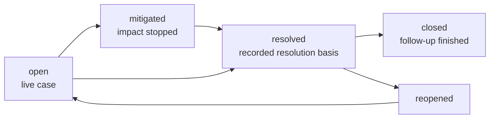

# Incidents

Every case, filtered the way you want it. The dashboard shows you the top of this list; this page is
the whole of it.

## The three tabs

| Tab | Contains |
| --- | --- |
| **Open** | Every live case, whether it needs a person or the platform is handling it |
| **Closed** | Resolved and closed cases |
| **All** | Everything, in one list |

Each tab carries its own count. Who is handling an open case is shown on its card, not by a
separate tab: **Needs human** when something is waiting on a person (an approval, a blocked
investigation, an unverified recovery, a current operator decision, or work without recorded
automation), and **SRE Platform handling** when the engine is working on it and has not asked for
anything.

## Search, severity, and sort

Search matches the title, the service, the source, the channel, or the incident identifier. The
severity filter narrows to one level. Both are applied by the server, so filtering a long history
does not depend on how much of it your browser has loaded.

The list is newest first by default. **Sort** also offers oldest first, and severity (the most
severe first, newest first within a level). On the **Open** tab it also offers **Needs human
first**, which puts cases waiting on a person at the top, then orders by severity, lifecycle
state, and most recent activity. That ordering follows live handling state, so it is not offered
for the paginated **Closed** and **All** tabs. Whatever the sort, a symptom stays nested under its
direct cause.

## Reading one card

Every card is the same shape.

| Part | What it tells you |
| --- | --- |
| Severity pill | How bad, as the alert declared it |
| State chips | Whether it needs a person or the platform is handling it, why, and whether an alert is still unresolved |
| Title | The alert's own words, not a generated summary |
| **Downstream symptom of** | Present only when evidence names another incident as this one's direct cause |
| Service, source, channel | Which service, which monitoring tool raised it, which Slack channel it arrived in |
| **Decision required** | Present only when a person is blocking. Names the decision, the responsible team, and what the platform will do next without you |
| Assessment | The trusted conclusion, or "No trusted assessment yet" |
| Age and workspace link | When it opened, and the way in |

The **Decision required** box is the important one. It never says "look at this"; it names the
specific decision, so you can tell whether it is yours to make before you open anything.

## Incidents that share a cause

When evidence establishes that one incident caused another, the queue stops presenting them as
unrelated work. The direct cause is listed first and its symptoms follow it, indented under it, with
the indentation stopping after three levels so a deep chain stays readable. Each symptom names its
direct cause under its own title.

The nesting is presentation. Every incident in the group keeps its own card, its own investigation,
and its own Slack thread, and opening any of them shows the whole graph and the way back to the
root.

## Creating an incident yourself

**Create incident** opens a case from evidence the platform already holds, for something monitoring
never alerted on. An incident created this way has no Slack thread, because no conversation started
it. It lives on the dashboard only.

## What the states mean

Status is changed by people and by a fixed policy, never by the model on its own, and never by
something said in conversation. An alert clearing is evidence the problem stopped. It is not proof,
and the incident's resolution policy determines the evidence required before automatic resolution.
Provider-only resolution is labeled **Resolved from provider signals**, with **Health not independently
verified**. A historical health assessment does not replace that basis.

**SRE Platform handling** requires a queued or processing incident job, or a scheduled monitoring
recovery check. A leftover investigation status does not count as active work. A current structured
operator decision still requires human attention while automation is running.

Completed investigation results appear separately from the last trusted assessment. A failed run
shows a safe blocker description; provider rate limits include the account-limit check and retry
step. Other raw provider errors are not displayed.
