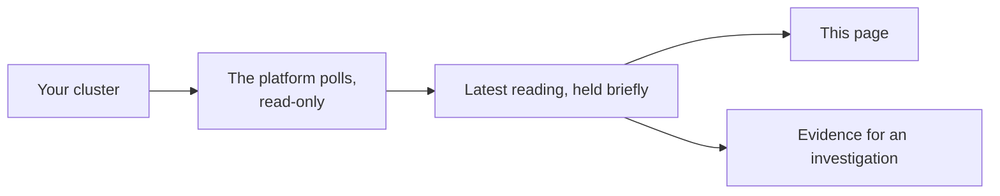

# Infrastructure

What your cluster looks like right now: pods, nodes, and why any of them are unhappy.

## Current health

Four counts across everything the platform can see.

| Count | Means |
| --- | --- |
| **Healthy** | Running, ready, no recent restarts |
| **Attention** | Not ready, restarting, or under pressure |
| **Stale** | The last observation is too old to trust |
| **Errors** | The data source returned an error instead of a reading |

**Stale** and **Errors** are about the platform, not your cluster. They mean the picture is
unreliable, which is a different problem from the cluster being unhealthy, and is why they are
counted separately.

## Filters

Search matches the resource name. Status, kind, and namespace narrow the list. Whatever you filter
to, **issues are shown first**, so the list never buries a crash loop under forty healthy pods.

## Reading a row

| Column | What it tells you |
| --- | --- |
| Health | The lane the resource is in |
| Resource | The name, and whether it is a pod or a node |
| Namespace | Its namespace, or cluster-scoped for a node |
| Signals | Why it is in that lane: the phase, the restart count, the container state, and any previous termination reason with its age |
| Observed | When this reading was taken, in your local time |
| Investigation | Opens an incident from this resource |

The **Signals** column is the one that answers "why". A row does not just say "Attention"; it says
`CrashLoopBackOff`, and it says the previous container was `OOMKilled` nine minutes ago.

## Investigate

**Investigate** opens an incident from what the platform is looking at, for something monitoring has
not alerted on. Because it was declared here rather than raised by an alert, it has no Slack thread
and lives on the dashboard.

## Where this comes from

Only the most recent reading is kept, and only for a short time. This page is a live view, not a
history, which is why a source that stops responding shows as **Stale** rather than quietly showing
you yesterday.

To connect a cluster, see [Kubernetes](../connectors/kubernetes.md).
