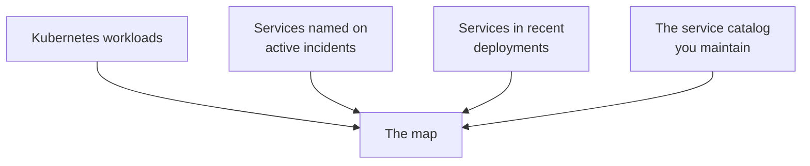

# Topology

What depends on what, and what is affected right now.

## Operational overview

A count of services, registered relationships, pods, and nodes, then five health lanes.

| Lane | Means |
| --- | --- |
| **Active incident** | A live incident names this service |
| **Needs attention** | Unhealthy runtime, no incident open |
| **Stale** | The last reading is too old to trust |
| **Healthy** | Running and current |
| **No telemetry** | Known from the catalog, but nothing is reporting on it |

**No telemetry** is not a failure. It usually means a service is in the catalog but nothing has been
connected that can see it, and it tells you where the map is thin.

## Where the services come from

Four sources, merged. The **Source** filter narrows to any one of them.

## Dependencies are declared, never guessed

A line between two services exists because someone registered it. The platform does not infer
dependencies from traffic, and [Service topology](../understand/topology.md) explains why. **Edit
catalog** is where you add the ones that matter.

## The map and the list

**Map** draws the graph. Drag to move, scroll to zoom, **Fit services** frames everything, **Reset
view** returns to the start.

**List** is the same data as text, which is easier to search and to read on a small screen.

## Incident overlay

Pick an active incident and the map colours by that incident's blast radius, so you can see what
else is downstream of the thing that is broken.

## Blast radius

Selecting a service answers: if this is broken, what else is in trouble? Callers are sorted into
**Direct**, **Indirect** and **Insulated**. The rules, and why a caller lands in each group, are
defined once in [Service topology](../understand/topology.md#blast-radius).

**Insulated** is the useful one. It is what tells you which teams do not need to be woken up.
