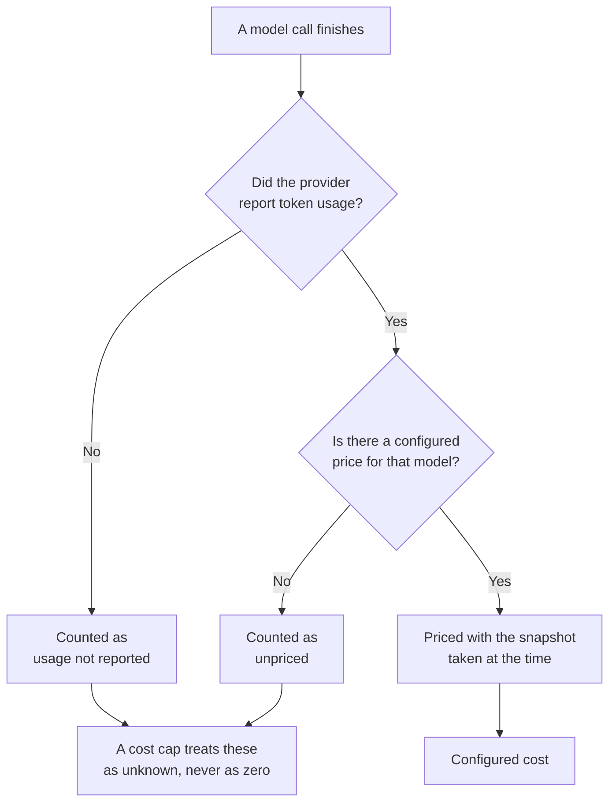

# Usage & Cost

What the model has cost you, and what the platform is not sure about.

## Time range

Preset windows, or custom dates. The exact interval being shown is printed underneath, in your local
time, so a chart is never ambiguous about what it covers.

## Summary

| Figure | Means |
| --- | --- |
| **Configured cost** | Priced with **your** prices, taken from the snapshot stored with each invocation |
| **Invocations** | How many model calls, split into succeeded and failed |
| **Tokens** | Input, output, cache read, and cache write, counted separately |
| **Provider estimate** | What the provider itself reported, where it reported anything |

Two things worth knowing.

**Prices are frozen at the time of use.** Each invocation stores the prices that were in effect when
it ran, so editing today's prices does not rewrite what last month cost.

**The provider estimate is reference only.** It is not a billing statement, and the page says so.
Your bill comes from your provider.

## The warnings under the summary

These are the honest part of the page, and they are shown rather than folded into the total.

| Warning | Means |
| --- | --- |
| Invocations with token usage but no configured price | Real work happened that the platform cannot price, because you have not entered a price for that model |
| Invocations that have not reported token usage | The provider returned no figures, or the work is still running |

A cost cap will not treat unknown cost as zero. If usage is pending or unpriced, automatic work
pauses rather than risking an unbounded spend. That is why an unpriced model is worth fixing:
it does not just leave a gap in a chart, it can stop automatic investigations.

## Cost over time

Daily configured cost. Red markers are days with failed invocations, so a spend spike caused by
retries is visible rather than buried.

## Setting caps

Caps are set by a platform administrator under **Platform administration** → **Platform settings**,
not on this workspace's Settings page. They are rolling 24-hour windows, per workspace and per
monitor, by count and by cost. [Platform settings](../operate/settings.md) lists each cap with its
bounds and fallback.
