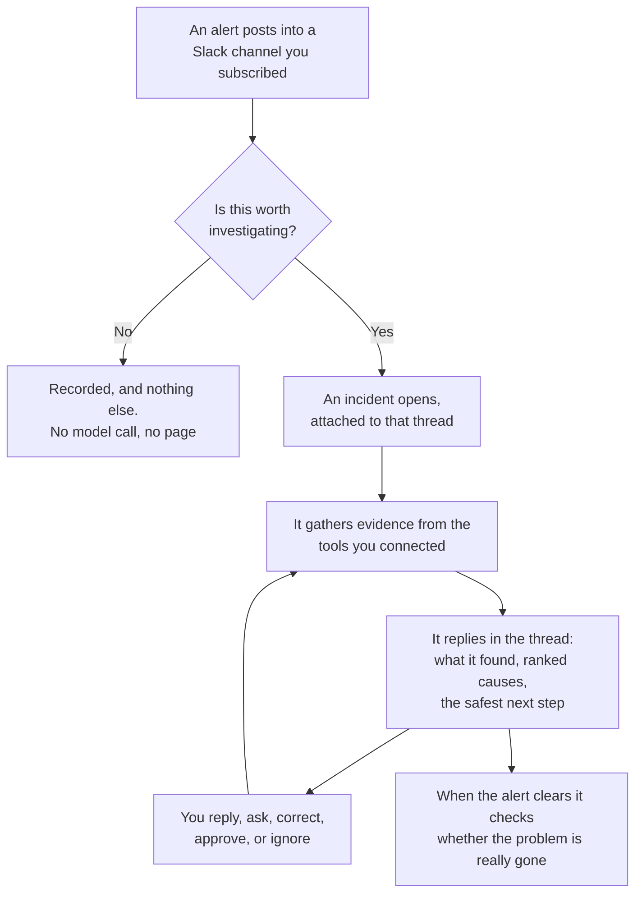

# SRE Intelligence Platform

An alert fires in Slack. The platform investigates it the way a senior engineer would, and replies
in the same thread with what it found and what it recommends.

## What happens when an alert fires

## What it will not do

These are design decisions, not missing features.

- **It never changes your infrastructure.** Every connector is read-only. It holds no credential
  that can restart a pod, revert a deploy, or silence an alert. When it recommends one of those, a
  person does it.
- **It never names a person as a cause.**
- **It never changes an incident's status because of something said in conversation.** Status
  changes are explicit.
- **It never claims a service recovered just because an alert stopped firing.** It verifies first.
- **It never falls back to a second model vendor.** Silently answering from a different model with
  different behaviour is worse than saying the engine is unavailable.

## Where to start

| You want to | Go to |
| --- | --- |
| Run it on your own machine | [Get started](get-started/index.md) |
| Understand a screen you are looking at | [Dashboard](dashboard/index.md) |
| Manage your workspace, its sign-in methods, and its members | [Use](use/workspace-settings.md) |
| Give it access to your systems | [Connect your tools](connectors/index.md) |
| Know how it reaches its conclusions | [How triage works](understand/triage.md) |
| Configure the model, budgets, and access | [Operate](operate/index.md) |
| Change the platform itself | [Build](build/index.md) |

## Two ways to work with it

**In Slack.** The investigation appears in the alert's own thread. Reply to ask questions, correct
it, or approve a recommendation. You do not have to open anything.

**On the dashboard.** The same conversation, plus everything Slack deliberately leaves out: every
lookup it made, the evidence behind each claim, the alternatives it ruled out, and what it cost.
