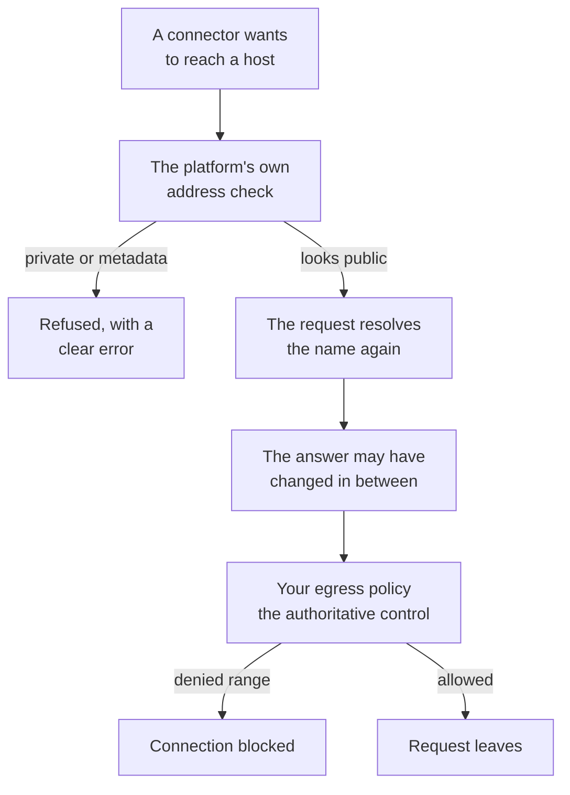

# Network policy

The platform checks every outbound URL before it connects, but that check is defence in depth, not
the control you should rely on.

There is a gap it cannot close on its own: a hostname is resolved once to validate it, then resolved
again when the request is actually made. A DNS answer that changes in between can point the second
lookup at a private address. Only a network policy around the workers closes that gap, so the rules
below are the authoritative control.



## Egress rules for the workers

Deny these unconditionally. Nothing in the product needs them, and they are exactly what a rebound
DNS answer aims at:

| Range | What it is |
| --- | --- |
| `169.254.0.0/16` | Link-local, including the `169.254.169.254` cloud metadata endpoint |
| `127.0.0.0/8`, `::1/128` | Loopback |
| `0.0.0.0/8`, `::/128` | Unspecified. On Linux, connecting to `0.0.0.0` reaches localhost |
| `fe80::/10` | IPv6 link-local |
| `fec0::/10` | Site-local. Deprecated by RFC 3879, still resolvable |

Deny these too, unless you run a connector against a backend on a private network:

| Range | What it is |
| --- | --- |
| `10.0.0.0/8`, `172.16.0.0/12`, `192.168.0.0/16` | Private address space (RFC 1918) |
| `100.64.0.0/10` | Carrier-grade NAT (RFC 6598) |
| `fc00::/7` | IPv6 unique local addresses |

Prometheus, Grafana, Argo CD, and GitLab are commonly deployed inside a private network, so the
platform allows them to target one. If you have enabled any of them, narrow this second group to the
addresses those backends actually occupy rather than dropping it entirely. Leave the first group
intact either way.

## Monitoring the cluster the platform runs in

The Kubernetes API server of the cluster the platform is deployed into sits on a private address, so
the second group above blocks it. The Kubernetes connector then reports the cluster as unreachable
after its eight second timeout, and nothing says a network policy refused it. Every other connector
keeps working, which is what makes this look like a connector fault.

On Cilium, the Helm chart opens this case for you. Turn it on and leave the rest of the policy alone:

```yaml
networkPolicy:
  apiServerEgress:
    enabled: true
    port: 6443
```

Read the port from the API server's own endpoint, which is rarely 443:

```bash
kubectl get endpoints kubernetes -n default
```

That setting renders a Cilium policy selecting the API server as an entity rather than by address. It
is additive with the policy above, so every other egress restriction stays in force, and it selects
only the two components that need it.

### Why an address rule cannot do this

The obvious fix is an approved private egress entry naming the API server. It does not work, for two
independent reasons, and it fails silently: the rule is accepted, it compiles into the running
policy, and it never matches a packet.

The first reason is that the address you write is not the address the plugin sees. Reaching the API
server through its service address goes through a destination rewrite before egress is evaluated, so
a rule naming the service address and port 443 is compared against a packet already addressed to the
node and its endpoint port. The command above prints what the plugin actually sees.

The second reason is that naming the node address instead does not help either. Cilium's
documentation states that
[CIDR-based selectors do not match in-cluster entities by default](https://docs.cilium.io/en/stable/security/policy/layer3/#selecting-pods-or-nodes-with-cidr-ipblock),
and it classifies a node address as a cluster node rather than as an outside address. So no
address-based rule reaches the API server at any address, unless the cluster is configured to let
CIDR selectors match nodes.

Selecting the API server as an entity is what the chart setting does, and it is the only form that
names the destination the plugin resolves.

### On a plugin other than Cilium

The chart setting emits a Cilium resource, so leave it off elsewhere. Add an approved private egress
entry instead, using the node address and endpoint port that the command above printed rather than
the service address:

```yaml
networkPolicy:
  privateEgress:
    - to:
        - ipBlock:
            cidr: NODE_ADDRESS/32
      ports:
        - protocol: TCP
          port: 6443
```

Whether that takes effect depends on how your plugin classifies node addresses. Confirm it rather
than assuming, using the check below.

### Confirming it worked

From a component the policy selects, a blocked path times out and an open one answers. A certificate
complaint still counts as reachable, because the connection had to succeed for a certificate to
arrive:

```bash
kubectl exec deploy/sre-platform-api -- bun -e 'try { console.log("reached", (await fetch("https://SERVICE_ADDRESS/api", { signal: AbortSignal.timeout(5000) })).status) } catch (e) { console.log(e.name, e.message) }'
```

A `TimeoutError` means egress is still closed. Anything else means the path is open and only
credentials remain.

## Instance metadata

On an ECS task, require IMDSv2 so a request that does escape cannot read instance credentials:

- `HttpTokens=required`
- `HttpPutResponseHopLimit=1`

## Why both

The network policy and IMDSv2 together are what actually stop a request reaching somewhere it should
not. The platform's own URL check runs earlier and gives you a clear error instead of a mysterious
timeout, but it cannot close the resolution gap by itself. Deploy both.
