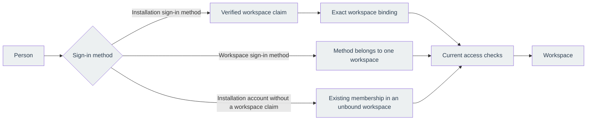

# Identity and access

SRE Platform separates three questions that are easy to confuse:

1. Who did the company directory authenticate?
2. Which workspace may that person enter?
3. What may that person do there?

The browser receives an opaque application session after company sign-in. It does not keep company
access, refresh, or identity tokens as platform credentials. The server stores only a hash of the
session secret and checks current access on every request.

## Screen language and system meaning

The screens use everyday words; this table maps them to the terms defined in the
[Glossary](glossary.md).

| On the screen | System meaning |
| --- | --- |
| Workspace | The tenant boundary for data, settings, and access |
| Workspace address | The stable slug used in public sign-in and product links |
| Company sign-in, Sign-in methods | A workspace sign-in method: one OpenID Connect provider and client configured by a workspace owner for one workspace |
| Identity providers, staff provider | An installation sign-in method: one OpenID Connect provider and client configured by a platform administrator for the whole installation |
| Choose your company account to continue | Several installation sign-in methods match your work email; pick the one you use |
| Binding provider, Binding claim, Tenant claim value | A workspace binding: the exact token claim value on an installation sign-in method that selects one workspace |
| Work email domain | A domain bound to a sign-in method after DNS verification |
| Member, admin, owner | A membership role inside one workspace |
| Platform administrator | A separate installation-wide operator grant |
| Provisioned account | A provider-scoped directory account received through SCIM |
| Browser session | A bounded, revocable application session backed by PostgreSQL |

## Two sign-in topologies

An installation sign-in method routes through a verified token claim and an exact workspace binding.
An installation account without a workspace claim can also select an existing active membership, but
only when that workspace has no workspace binding of its own and does not require a workspace
directory. The platform does not infer membership from an email address or an administrator grant.

Enter your work email to find your sign-in method. After authentication, choose a workspace if needed.
Selecting an eligible membership does not ask you to authenticate again. A workspace with its own
workspace sign-in method still requires that method and its verified claims. Unavailable workspaces
explain what needs configuring instead of sending you to a sign-in dead end.

The selected workspace is stored in the server-side browser session. Selection does not extend the
original authentication deadline. Switching closes existing live connections, and every subsequent
request and live connection check revalidates membership and workspace policy.

A workspace sign-in method belongs to one workspace. Different workspaces may register different
clients at the same directory issuer. The saved method and client identify the sign-in attempt, so
sharing an issuer never merges people or workspaces.

## The access checks

Successful company authentication is necessary but not sufficient. Every request checks the current
application session, user account, sign-in method, workspace, membership, and any linked provisioned
account. The earliest failed check ends access.

This is why a removed member cannot return by authenticating again, a suspended or deleting
workspace does not open an empty dashboard, and a SCIM deactivation can end existing access. Live
revoke messages close streams quickly, while PostgreSQL remains authoritative if a message is missed.

Email has a deliberately narrow role. A provider-verified email, or a completed mailbox challenge,
can support discovery and a safe invitation match. It never replaces the provider's stable subject
identifier, and it never proves control of a company domain. DNS verification is a separate step.

## Platform administration is separate

A workspace owner controls one workspace. A platform administrator controls installation-wide
settings and support operations. One role does not imply the other. The first platform administrators
come from the deployment bootstrap, and later grants use the audited administration area.

When a platform administrator enters a workspace for support, the session is explicit, time-limited,
and audited. It does not create an ordinary membership or silently change workspace ownership.
