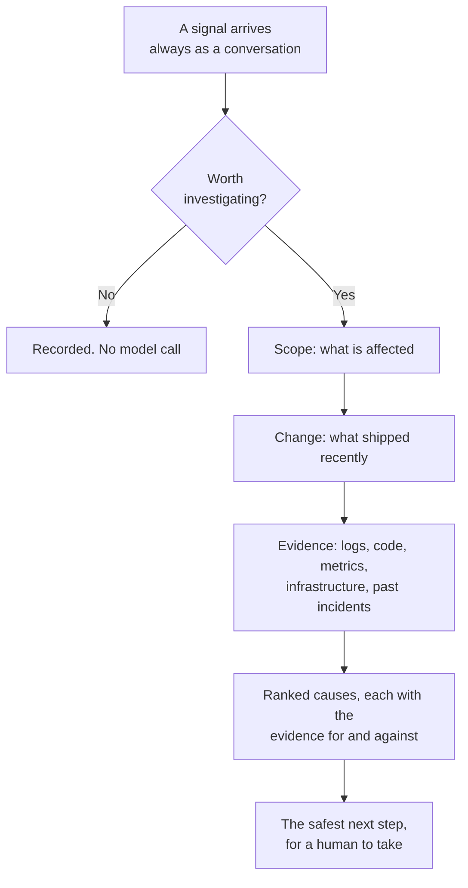

# Understand

Why the platform behaves the way it does.

The [Dashboard](../dashboard/index.md) section tells you what each screen shows. This section tells
you what is happening behind it, and why the design refuses certain things that would be easy to
build.

| Page | Answers |
| --- | --- |
| [Identity and access](identity.md) | How sign-in, workspace selection, roles, and browser sessions fit together |
| [How triage works](triage.md) | What happens between an alert firing and an answer appearing |
| [Service topology](topology.md) | How it decides what else is affected, and why it will not guess |
| [SRE doctrine](philosophy.md) | The principles it is built on, and which are not built yet |
| [Glossary](glossary.md) | Every term this guide uses |

## The shortest version

Scope before cause, cause before recommendation. That order is fixed, and it is the same whichever
model provider you configured.

## The one rule everything else follows from

**Every claim is tied to a lookup that actually happened.** A claim the platform cannot tie to real
evidence is dropped before you see it, confidence falls when evidence is thin, and an investigation
that could not reach a conclusion says so rather than producing a plausible paragraph.
