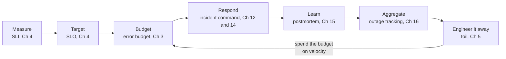

# SRE doctrine

Why this platform is shaped the way it is, and what it refuses to become.

The reference is [*Site Reliability Engineering*](https://sre.google/sre-book/table-of-contents/)
(Beyer, Jones, Petoff, Murphy; O'Reilly 2016), cited by chapter throughout. Where the platform
departs from the book, the departure is stated as one rather than hidden.

Each principle below carries a status line saying whether it is built today. Most are not. They bind
what gets built next, they do not describe what the platform does now.

## The loop the book describes

The book is not a collection of practices. It is one control loop:

A platform that implements only **Respond** is a firefighting tool. The engineering discipline lives
in the arrows out of **Budget** and back from **Learn**. This platform's job is to close that loop
for its tenants, and to be honest about which segments it has actually built.

## Principles

### 1. Reliability is measured, never asserted

**Built.** Objective definitions and computed burn events are stored and evaluated on a schedule. The underlying samples are not.

> "An SLO is a service level objective: a target value or range of values for a service level that is
> measured by an SLI."
> Source: [Ch 4](https://sre.google/sre-book/service-level-objectives/)

Every health figure the platform shows must resolve to a query you can re-run yourself against your
own metrics backend. The platform will store objective *definitions* and computed *burn events*. It
must never store the underlying samples and must never become a time-series database. Datadog and
Prometheus already hold that history and stay the source of truth.

Chapter 4's guidance on choosing targets binds product decisions here: do not pick a target from
current performance, keep aggregations simple, avoid absolutes, and **have as few objectives as
possible**. An interface that makes it easy to define forty objectives per service has misunderstood
the chapter.

### 2. The error budget is a read model, never an ingress

**Built.** The budget enriches the incident opening brief, stamps deploys with an advisory risk
figure, and is reported on its own panel. Nothing on that path can open an incident, and a source scan
of the three ingress symbols enforces it.

100% is the wrong reliability target for essentially everything (Ch 3). The gap between the objective
and reality is a budget, and the budget is what turns reliability from an argument into arithmetic.

The budget is a **read model only**. It enriches an incident's opening brief, marks a deploy as risky,
and is reported on the error budgets panel. It never opens an incident. Measurement does not need
ingress, so this leaves intact the rule that an alert becomes an incident only through a conversation.
Ranking services by remaining budget, and feeding budget figures into reliability reports, are
intended uses that are not built yet.

If a fast burn genuinely needs a human right now, that is your Alertmanager or PagerDuty doing its
job. The platform is not a pager.

### 3. Not every signal is a page

**Built.** One metered semantic classifier call assigns every material free-form signal a durable
disposition and correlation decision. Structured provider identity and ordering remain deterministic.
Enforcement stays in shadow mode until the current runtime achieves a perfect reviewed-corpus score
with no critical safety miss and an operator approves it.

> Alerts signify that a human needs to act **immediately**. Tickets signify that a human needs to act,
> **but not immediately**. Logging: **no one needs to look at this**, but it is recorded.
> Source: [Ch 1](https://sre.google/sre-book/introduction/), paraphrased

Three outputs, not two. Every ingested signal should resolve to exactly one of:

| Disposition | Meaning | Cost |
| --- | --- | --- |
| Investigate | Urgent, actionable, user-visible now. Opens an incident and spends a full engine run. | A model investigation |
| Ticket | Real but not urgent. Recorded and queued for human review, no investigation run. | One classifier call plus storage |
| Log | Not a reliability problem. Recorded as a system of record, never surfaced unless asked. | One classifier call plus storage |

Investigate is not the default. Chapter 6's test for a page, *"Does this rule detect an otherwise
undetected condition that is urgent, actionable, and actively or imminently user-visible?"*, is the
test for spending an investigation.

The log tier exists because a silently dropped signal is invisible to analysis. Chapter 16 records
teams deliberately routing non-paging events into their tracker purely so they could be tagged,
annotated and reviewed. A filter nobody can audit is a filter nobody should trust.

Today, a recognised firing, warning, or predictive provider alert in a subscribed channel cannot be
discarded as not worth investigating. If the model tries, a structural check opens a low-severity
investigation anyway. Human chatter, ordinary bot status, and unmatched recovery notices can still be
filtered out.

### 4. Aggregate, tag, analyse

**Built.** Grouping, tenant-isolated free-form tags, evidence-backed cause suggestions, and bounded
cross-incident reliability reports are available. Reports disclose their durable-data definitions,
period boundaries, page service results, and label ranked cause counts as sensitivity indicators,
not severity scores.

Chapter 16 is the closest thing in the book to a specification of this product, and it names four
capabilities. Grouping many alerts into one incident is only the first.

> "As trivial as tagging appears, it is probably one of the Outalator's most useful unique features."
> Source: [Ch 16](https://sre.google/sre-book/tracking-outages/)

Tags are free-form single words, with a colon as a semantic separator so hierarchies emerge
naturally: `cause:network:switch`, `action:rollback`, `bogus`. Prefixes are **suggested from your own
history**, never imposed as a fixed list. The chapter is explicit that avoiding a predetermined list
yields better data.

Tagging exists to serve analysis: incidents per week, **alerts per incident**, which component causes
the most incidents, and whether this week's load is normal against your own track record. Chapter 16
calls enabling that analysis one of the most important functions of an outage tracking tool.

### 5. Structure the response before you debug it

**Not built today.** The conversation is a command post with no roles, no state document, and no
handoff.

> "Your first response in a major outage may be to start troubleshooting and try to find a root cause
> as quickly as possible. **Ignore that instinct!**"
> Source: [Ch 12](https://sre.google/sre-book/effective-troubleshooting/)

Chapter 12's order is triage, examine, diagnose, then test and treat, where triage means stop the
bleeding and preserve evidence, not start root-causing fast. The platform's investigation sequence is
a good implementation of examine and diagnose. It should never present a root cause as though it were
a mitigation.

Chapter 14 supplies the structure around it: an incident commander who holds high-level state, an
operations lead who is *the only person modifying the system*, a communications lead, and a planning
lead. Plus a recognised command post, a **live incident state document**, and an explicit handoff,
"You're now the incident commander, okay?", that is not complete until it is acknowledged.

The incident conversation is already the command post. The roles, the state document, and the handoff
are what remain.

### 6. Postmortems are not runbooks

**Built.** A responder generates a postmortem from the incident workspace under a declared trigger;
it carries contributing causes and typed action items with an owner, a tracker link and a state
tracked to done, and the Reliability workspace counts untracked and past-due items rather than
hiding them. Automatic triggers are not built; every postmortem is commanded by a person.

The platform generates runbooks, meaning *how to fix this next time*. A postmortem is a different
artifact with a different purpose: what the contributing causes were, and **what will change so it
does not recur**.

> "Postmortems are expected after any significant undesirable event. Writing a postmortem is not
> punishment, it is a learning opportunity for the entire company."
> Source: [Ch 15](https://sre.google/sre-book/postmortem-culture/)

Triggers are defined *before* an incident, not after. Chapter 15's list: user-visible downtime or
degradation beyond a threshold, data loss of any kind, an on-call intervention such as a rollback, a
resolution time above a threshold, and a monitoring failure.

The artifact carries a summary, impact, contributing causes, trigger, resolution, detection, lessons
learned, a timeline, and the part that does the work: **action items, each typed as prevent, mitigate
or process, each with an owner and a tracker link, each tracked to done**. The book's
[example postmortem](https://sre.google/sre-book/example-postmortem/) also offers an "other" type; the
platform drops it deliberately, so every action item has to state its purpose. A postmortem whose
action items are untracked is theatre.

### 7. Blameless by construction

**Built.** The generator runs under a blameless instruction, then a guard replaces every workspace
member email, email local part, mention token, handle and any email-shaped token in the generated
text with a neutral noun, and a test proves it. The stated limit: a bare first name typed in chat
that is not a member's email local part is not caught, and the instruction is the only defence there.

> "A blamelessly written postmortem assumes that everyone involved in an incident had good intentions
> and did the right thing with the information they had."
> Source: [Ch 15](https://sre.google/sre-book/postmortem-culture/)

Because the platform generates the artifact, this is a property it can guarantee rather than a value
it can merely hold. No generated postmortem, runbook, or summary will name a person as a cause.
Recording who was involved is attribution, meaning who to ask. It is never causation.

### 8. No magic without a falsifier

**Built.** Every graded assessment run keeps the confidence it claimed beside a verdict from a
responder's confirm or correct, or from the model judge once a postmortem is published, and the
Reliability workspace reports whether the claimed confidence predicts being right, only from a
minimum sample and never as a rescaled score.

> "We avoid 'magic' systems that try to learn thresholds or automatically detect causality."
> Source: [Ch 6](https://sre.google/sre-book/monitoring-distributed-systems/)

This platform is a magic system by construction: a model inferring causality is precisely what
chapter 6 warns about. The book's objection is not to inference, it is to inference nobody can check.

So every causal claim ships with the evidence that produced it, and every claim should be scoreable
afterwards against the postmortem's contributing causes. A confidence score that is never compared to
an outcome is a number pretending to be a measurement.

Chapter 12's troubleshooting pitfalls are the failure modes to score against: irrelevant symptoms,
misread metrics, wildly improbable theories, latching onto the cause of a past incident, and hunting
spurious correlations. The last two are exactly what retrieving similar past incidents risks
inducing, which is why a retrieved runbook is always treated as a suggestion that has to be checked
against the incident in front of you.

### 9. Toil the platform creates is toil the platform owes

**Built.** The reliability report counts durable approval demands, clarification requests, degraded
re-asks, and finding corrections alongside first-hypothesis latency, responder turns, cited runbook
adoption, and incidents resolved without responder or approved action.

> "Toil is the kind of work tied to running a production service that tends to be manual, repetitive,
> automatable, tactical, devoid of enduring value, and that **scales linearly as a service grows**."
> Source: [Ch 5](https://sre.google/sre-book/eliminating-toil/)

Google caps operational work at 50% of an engineer's time (Ch 1, Ch 5). A platform selling toil
reduction must be able to prove it moved that number, and must count the toil it *introduces*: every
approval it demands, every clarifying question it asks, every wrong hypothesis a human has to correct.

Reported per tenant: alerts per incident, time to first hypothesis, human turns per incident,
runbook adoption, and the number of investigation findings corrected by humans. The correction
count is a toil signal, not a cause-accuracy rate. If those numbers do not improve, the product is
not working, however good the transcripts read.

### 10. Simplicity is a feature

**Holds today.** The three constraints it names are live: one pair of datastores, one model provider,
one way an incident can be opened.

Chapter 9, and the platform's own history. An early version had an anomaly-detection subsystem. It
was deleted, because nothing ever read its output.

A subsystem with no reader is deleted, not documented. Prefer removing a capability to carrying a
dead one. This principle constrains all nine above: none of them justifies a new datastore, a second
model provider, or a second way into the incident funnel.

## Deliberate departures from the book

Stated as departures, with the reasoning, so they are not mistaken for oversights.

| The book says | The platform does | Why |
| --- | --- | --- |
| Ch 11 and 16: on-call rotations, escalation, acknowledgement timers | Nothing. Paging stays with PagerDuty or Alertmanager | You already run one. A second source of truth for the rotation is a reliability liability. |
| Ch 7: automation should *act* on production | Recommends; a human executes | Every connector is read-only. Holding your write credentials would create a new class of secret and a cross-tenant blast radius. |
| Ch 3: error budget policy halts releases | Budget risk on a deploy is advisory | There is no hook into your pipeline, so a hard gate would be a gate that cannot fire. Advisory is honest; a fake gate is not. |
| Ch 17: production probes, canarying, disaster testing | Out of scope | The platform observes your production. It does not run it. |
| Ch 27 and 32: launch coordination, production readiness review | Out of scope | Organisational process, not a product surface. |
