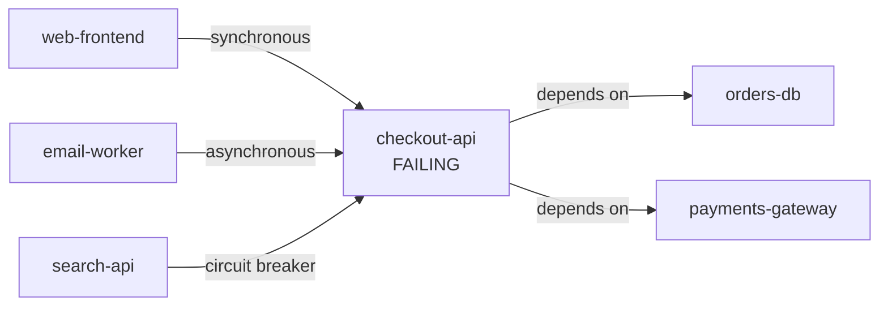

# Service topology

The platform keeps a map of your services and which ones depend on which. It uses that map to answer
one question fast: when this service breaks, what else breaks with it.

You browse and edit the map on the [Topology page](../dashboard/topology.md).
This page explains what the map is allowed to say, and why.

## What appears on the map

A service shows up as soon as any current source can name it:

- you registered it in the catalog,
- a live Kubernetes namespace carries its name,
- an active incident names it, or
- a recent deployment was tagged with it.

Each service shows where it came from. Nothing inferred is written down permanently, so a namespace
that disappears or an incident that closes takes its service off the map with it. Only what you
register yourself survives.

A service's status is decided in this order: an active incident, then a runtime problem, then a stale
reading, then healthy, then no telemetry at all. A recent deployment is shown as context and never
colours the status, because shipping is not the same as breaking.

## Dependencies are declared, never guessed

An edge on the map means one service calls another. The platform will not draw one unless a human
registered it.

Two services sharing a cluster or a namespace is not evidence that one calls the other, and a graph
that guesses would make blast radius confidently wrong. Automatic discovery is possible in principle,
from tracing or a service mesh, but the platform does not read such a source today.

Each edge records how the call is made:

- **Synchronous or asynchronous.** A synchronous caller goes down with its dependency. An
  asynchronous one degrades.
- **Whether a circuit breaker protects it.** A protected caller falls back rather than failing.
- **The protocol.**

Each service records its team and its criticality, on a three-tier scale. Both feed severity and who
gets paged.

## Blast radius

When a service fails, the platform walks the map outwards to its callers and sorts them into three
groups:

| Group | Meaning |
| --- | --- |
| **Direct** | Reached through an unbroken chain of synchronous, unprotected calls. Hard down. |
| **Indirect** | Reached across an asynchronous edge. Degraded, still up. |
| **Insulated** | Protected by a circuit breaker. Falls back. |

A hard failure travels through synchronous, unprotected calls for as many hops as it takes, and stops
at the first asynchronous or circuit-broken edge. That caller is the boundary, and everything behind
it is spared. A service reachable by more than one route takes its worst outcome.

It also lists the failing service's own direct dependencies as **suspects**, because the service you
were paged about may be the victim rather than the cause.

In this map `web-frontend` is **direct**, `email-worker` is **indirect**, `search-api` is
**insulated**, and `orders-db` and `payments-gateway` are the **suspects**.

The walk is depth-limited and says so when it hits the limit, and it handles services that depend on
each other in a loop without spinning.

A service nobody registered returns an empty result that says the service is not on the map. That is
not an error, it just means there is nothing to say yet.

## Where it is used

Blast radius runs automatically at the start of every investigation, so the first thing the platform
establishes is scope. The engine can also ask for it again mid-investigation for any service it
becomes interested in.

## Why it works this way

The design follows what established topology tools do, minus the parts that need telemetry this
platform does not collect.
[Grafana's service graph](https://grafana.com/docs/grafana/latest/datasources/tempo/service-graph/)
derives both health and edges from request telemetry.
[New Relic service maps](https://docs.newrelic.com/docs/new-relic-solutions/new-relic-one/ui-data/service-maps/service-maps/)
filter by health and entity type and reduce large views to the degraded parts.
[Dynatrace Smartscape](https://docs.dynatrace.com/docs/observe/application-observability/services/services-smartscape)
keeps service-to-service calls separate from service-to-infrastructure relationships.

The platform borrows the health precedence, the filtering, and that last separation. It does not
borrow telemetry-derived edges, because it has no telemetry to derive them from, and an edge it
cannot evidence is worse than no edge at all.
