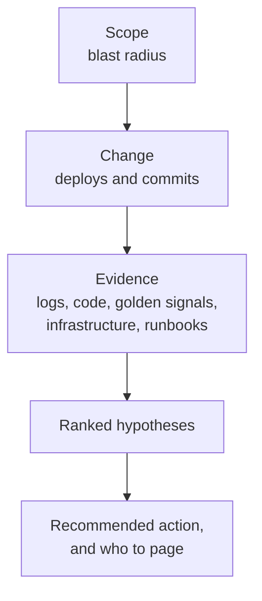
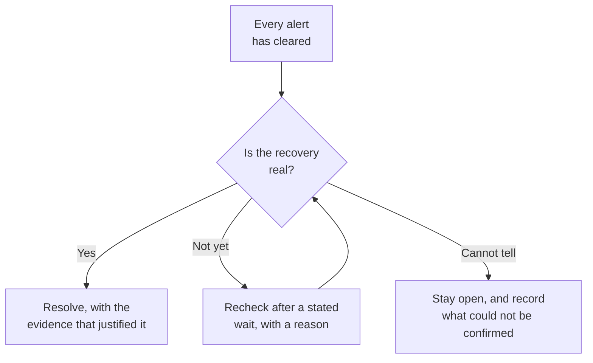

# How triage works

When an alert opens an incident, the platform investigates it the way a senior engineer would: it
gathers evidence, forms ranked hypotheses, and posts what it found back into the same conversation
the alert arrived in. This page explains what happens in between, and what the platform will and
will not do on its own.

To change which model does the work, see [Triage engine](../operate/triage.md).

## The short version

1. An alert arrives, or an operator declares an incident.
2. The platform opens the incident and starts an investigation.
3. It gathers evidence from whichever connectors you have enabled.
4. It posts a summary, a confidence score, ranked hypotheses, and the safest next step.
5. You reply in the thread. It answers, revises, or proposes an action.
6. When the alert clears, it checks whether the problem is actually gone before resolving.

## The investigation sequence

Every investigation follows one fixed sequence, and it is the same regardless of which model
provider you configured. The order matters: it establishes scope before cause, and cause before
recommendation.

1. **Blast radius.** Which service is affected, and what depends on it.
2. **Deploy correlation.** Recent commits, deploys, or pipeline changes that line up with when the
   problem started.
3. **Logs.** Error logs for that service in the window around onset.
4. **Code evidence.** If a log or deploy points at specific code, it reads that code at the exact
   revision that is running. A match on the default branch is treated as a lead, not proof. Finding
   a line proves location, not cause.
5. **Golden signals.** Latency, traffic, errors, saturation.
6. **Infrastructure.** Pods, nodes, restarts, capacity.
7. **Runbooks.** Similar past incidents. See [How it treats past incidents](#how-it-treats-past-incidents).
8. **Ranked hypotheses.** The likely causes, weighed against the evidence, each with the signals
   supporting and contradicting it.
9. **Recommended action.** The safest next step, least risky first.
10. **Escalation.** If the cause is unclear or the impact is severe, who to page.

Scope before cause, and cause before recommendation. That order is fixed.

Anything time-windowed anchors to **when the incident started**, not to the current clock. An alert
reported an hour late still refers to the moment it fired. If the start time cannot be determined,
it uses the last 15 minutes or asks you for a range.

## Evidence, not speculation

The platform is built to be wrong out loud rather than confident and unsupported.

- Every factual claim cites a specific piece of evidence it actually gathered. Claims it cannot tie
  to a real lookup are dropped before you see them.
- Confidence drops when the evidence is thin or a step could not run.
- A truncated result is labelled as truncated. A partial answer never counts as proof that something
  is absent.
- Every investigation ends with an explicit outcome: **conclusive**, **inconclusive**, or **blocked
  because a capability is missing**. Only a conclusive one becomes the incident's trusted
  assessment. An inconclusive run is recorded and shown, but it does not overwrite a good earlier
  answer.
- Every remaining open question is classified, so you can tell "we did not look" from "we looked and
  could not tell" from "you need to decide this".
- Connections that can name their own login (currently Grafana) tell the investigation which
  provider-side requests are the platform's own, so its traffic is never mistaken for an unknown client.

If the first draft leaves an answerable question unattempted and there is budget left, the platform
rejects its own draft once and goes back for the missing evidence.

### How it treats past incidents

A matching past incident is a **suggestion, never an answer**. The platform checks it against the
current incident before using it, says so explicitly when it does not match, and cites it when it
does. It will not fill gaps in the current investigation with details borrowed from an old one. How
often a runbook has been used, and whether a human has verified it, indicate institutional
confidence, not correctness for the incident in front of you.

## What it remembers

Within one incident, the platform keeps everything it has already looked up. When you reply and it
picks the investigation back up, it re-reads that stored evidence rather than querying your systems
again. Repeated identical lookups collapse to the most recent one, and each item keeps its original
timestamp so a stale fact cannot quietly become a current one.

Secrets are stripped before anything is stored or shown to the model, so credentials never reach the
model or the database.

## One provider, no fallback

Each deployment runs exactly one model provider. There is no automatic failover to a second vendor.
That is deliberate: silently answering from a different model with different behaviour is worse than
saying the engine is unavailable.

When the provider cannot be reached:

- The platform assembles a brief **without the model**, using your connectors directly, and posts it
  to the incident. Your connectors are unaffected by a model outage, so you still get real signal.
- It posts an escalation note and marks the investigation **degraded**. The incident's own severity
  and status are not changed, a model outage does not make your outage worse.
- It keeps retrying for roughly 25 minutes. When the provider recovers, the investigation completes
  normally.
- The brief and the escalation note are posted exactly once, no matter how many retries happen.

## Steering the investigation

Reply in the incident thread, from Slack or the dashboard, and the investigation continues. It
builds on what it already found rather than starting over.

It will do exactly one of four things:

| Response | When | Effect |
| --- | --- | --- |
| **Answer** | Your message is a question | Replies in the thread. The root-cause assessment is unchanged. |
| **New finding** | Your message brought new evidence that changes the cause | Writes a fresh assessment. |
| **Recommend an action** | There is a concrete next step | Posts a recommendation with Approve and Deny buttons. |
| **Stay silent** | Your message needs no reply | Records that it saw the message and says nothing. |

Only the second one rewrites the root cause. Ordinary conversation never changes the incident's
status.

Replies are handled one at a time per incident, so several people replying at once are answered in
order rather than talking over each other.

**Approving a recommendation does not execute it.** The platform never runs the command or changes
your infrastructure. Approval records a human decision; a human
carries it out. The proposal and the decision are both kept as an audit trail.

You can also attach a screenshot. The platform reads it, uses it as context for that turn, and
stores its interpretation alongside the incident. The image bytes themselves are never stored.

### Changing an incident's status

Status changes are deliberate and never inferred from conversation. Use the buttons on the incident,
or start a message with an explicit command:

- `Mark incident mitigated`
- `Resolve incident`
- `Close incident`
- `Reopen incident`

An optional reason can follow after `:`, `,`, `;`, `-`, or `because`. These are read by code, not by
the model. Lifecycle words used in ordinary prose, "I think we resolved it", are just
conversation.

You can keep asking questions on an incident that is already resolved. It will answer, and the
incident stays resolved: a late question does not re-decide a settled cause.

## Three things that are tracked separately

Conflating these is the usual source of confusion, so the platform keeps them apart.

| | Values | Means |
| --- | --- | --- |
| **Signal** | firing, unknown, resolved | What your monitoring says right now. |
| **Investigation** | queued, gathering, assessed, degraded | How far the platform has got. |
| **Incident** | open, mitigated, resolved, closed | The operational lifecycle decision, made by a responder or the recorded resolution policy. |

An alert clearing records what its provider reported. It does not independently prove service health
or decide ownership. Each incident records the criterion required for operational resolution:

- **Provider signals clear** accepts authoritative provider recovery for every signal in the response
  group. It resolves without an AI investigation and records **Resolved from provider signals** and
  **Health not independently verified**.
- **Verified recovery** requires every signal to be clear, fresh cited health evidence, and no
  pending approval. It can verify operator-corrected or legacy clears. A strict member makes the
  complete response group follow this criterion.

A new provider episode delivered through an authenticated native webhook (Alertmanager, Grafana,
Datadog or StatusCake) selects provider-clear policy. That path records its disposition directly and
does not run AI classification. Every incident opened from a Slack message selects verified recovery,
including a provider alert opened while classification is unavailable and the investigation is
degraded. For Slack messages, classification still controls whether a signal opens an incident,
becomes a ticket or is logged, and provider failures retain bounded retries. An active provider firing
cannot be silently logged; it requires at least a reviewable ticket. Manual reports and health checks
also retain verified recovery. Existing cases retain their recorded policy, and reusing an incident
never silently changes it. An operator can change the policy explicitly.

A Slack recovery notice, an edited alert message or a model suggestion that a message resolves an
alert is logged and never changes a signal. Suppressing a Slack notification never changes a signal
either. A recovery notice from the same bot in the same channel is linked to the one open incident
whose alert it names, found by the edited message's thread root or by the alert's monitor identity.
The incident conversation then records that the provider reported recovery in Slack, and the
workspace asks a responder to confirm resolution. A notice that matches no open incident, or more
than one, is only logged. Only connector-verified or native provider recovery counts as provider recovery evidence;
legacy clears and operator corrections do not. Under provider-clear policy, missing authority keeps
the case open with an explicit blocker.
Pending approvals prevent automatic resolution under either policy.

Provider-clear resolution preserves the investigation history. Root-cause analysis and prevention work
can continue as follow-up without delaying source-driven resolution. A later, separately identified
provider episode can carry recurrence context while retaining the earlier recovery evidence. Refiring
or delayed messages for the same episode still follow its identity and event-order checks.

## Recovery verification

For verified-recovery incidents, once every alert has cleared the platform checks current service
health. It reaches one of three conclusions:

- **Recovered**: resolves the incident, with the evidence that justified it.
- **Recheck**: waits a stated number of minutes and looks again, with a reason. While a recheck is
  pending the incident shows as monitoring, with the next check time visible. Intermediate checks
  are not posted to Slack, to avoid noise.
- **Needs a human**: keeps the incident open and records what it could not confirm.

Rechecks are capped, three by default, and configurable from 1 to 10. On the last permitted check a
further recheck becomes "needs a human" rather than looping.

The model never changes an incident's status directly. Under verified-recovery policy, the platform
requires current cited health evidence, unchanged lifecycle and signal state, and no pending approval.
A bounded review can correct the complete recovery report, removing unsupported cause or advice.
An unknown original cause or possible recurrence alone does not disprove supported current recovery.

New recovery reports separate **Blocks resolution** from **Follow-up work**. Each question names
its evidence category, attempted checks and a concrete next action. A human handoff requires a
blocking question; verified recovery cannot retain one. The first blocker supplies the next action
shown in the queue and the current run, so a reviewer failure does not leave a generic handoff. Unavailable checks count as attempts,
never as proof that a service is healthy. Follow-up work remains visible after resolution.
Historical string questions remain **Unclassified recovery questions**, without invented categories.

A responder can request a fresh recovery check in the incident conversation, including after
an earlier verification exhausted its automatic checks. A failed evidence review records its
current blocker without resolving the incident or replacing the trusted cause assessment.
An unavailable review is not evidence that the service remains unhealthy.

Missing, unavailable or invalid evidence keeps the case open or permits a supported bounded recheck.
Refiring signals, reopening, policy changes and causal membership changes invalidate stale recovery
decisions.

## Recurring and related alerts

Every new provider episode or Slack source root opens an independent incident and conversation. An
exact redelivery or edit of the same source updates its existing signal; a later firing never inherits
an old response workspace merely because the monitor name matches. Stable monitor identity records
immutable recurrence history.

One exception covers repeat Slack notifications. When a bot posts a new firing message in the same
channel, every alert in it carries a monitor identity, every one of those monitors is already tracked
by an open alert, and all of them belong to exactly one open incident seen in the last 24 hours, the
message is attached to that incident as another occurrence. It opens no incident and starts no new
investigation run, and is recorded as a log entry. A message that also carries an alert no open
incident tracks, or that matches no open incident or more than one, is classified as usual, as is a
repeat whose incident closes before it is attached.

Alerts that arrive close together enter a fixed, provider-scoped comparison cohort. The cohort is
sealed before one budget-admitted model call sees at most five incidents. It can suggest that a pair
may be related or record that they are unrelated. Timing cannot establish direction or merge records.

A possible relationship starts a focused reassessment using current evidence. A directed
**caused by** relationship requires a conclusive investigation, owned evidence, and sufficient
confidence. Each symptom can have one direct cause, cycles are rejected, and a model decision cannot
override a responder correction. The direct cause becomes the response root: recovery checks every
live signal in the causal group and resolves the group only when all are clear. Each member keeps its
own evidence and conversation.

Human merge and split remain evidence-backed and reversible. They refuse to run while investigation
work is active, and a merge source must first leave any active causal response group. Causal,
unrelated, merge, split, and rejection decisions remain attributed in the audit trail.

## Turning incidents into runbooks

You can turn a resolved or investigated incident into reusable knowledge on demand. The platform
classifies it into one of three outcomes:

- **A fix was confirmed**: writes a runbook.
- **No fix, but diagnostically useful**: writes an investigation note.
- **Nothing worth keeping**: writes nothing and says so.

When a runbook already covers the same cause, the model decides whether to refine that one or write
a new one. Generated runbooks are published unverified until a human marks them otherwise, and they
are visible only within your own tenant.

Runbook generation is auxiliary. It runs on its own queue so a backlog cannot delay triage, and a
failure to generate one never affects the incident itself. Asking twice does not produce two
runbooks or two charges.

## Spending limits

Automatic investigations can be capped per tenant and per monitor, by count and by cost, over a
rolling 24 hours. When a limit is reached the platform records that it stopped and asks for a manual
investigation instead of calling the model.

Investigations you start yourself, and replies you send, are manual. They bypass these caps.

## What it will not do

- Run a command or change your infrastructure. Repository issue changes require a separate opt-in
  and confirmation, not approval of an investigation recommendation.
- Fall back to a second model provider.
- Name a person as the cause of an incident.
- Change an incident's status because of something said in conversation.
- Claim a service recovered because an alert stopped firing.
